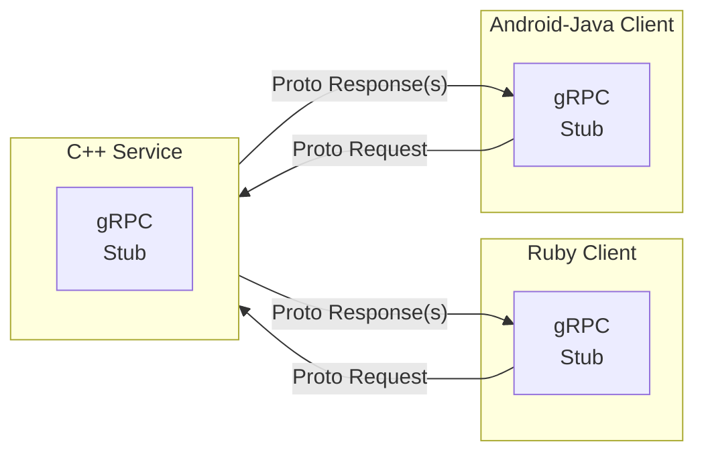

# gRPC

**gRPC** --- gRPC Remote Procedure Call

gRPC allows writing network level apps using data in different places.

It's a modern connection oriented, datastream.

## Terms

**BiDi** --- Bidirectional

## Uses HTTP/2

- Multiplexing
- Header Compression
- Binary Framing
- Firewalls and proxies understand HTTP/2

## Services

- Client - Server Oriented
- Streaming
- Blocking and non-blocking
- Flow control
- Protocol Buffers
- Message exchange
- gRPC clients talk to gRPC servers
- Uses HTTP/2 as transport
  - Does not expose HTTP2 to the user
- Easily encrypted with TLS
- Persistent connections
  - Heartbeats
- Uses application-level queue coalescence

## Message Types

Programs can do remote function calls on other servers.



## Transaction Types

**Unary**

- One request
- One response

**Client Streaming**

- Client sends multiple messages
- Server sends one response

**Server Streaming**

- Client sends one request
- Server sends multiple messages

**Bidirectional Streaming**

- Two independent streams
- Any read or write order


Image courtesy of Rob Shakir.

## gRPC network applications


Image courtesy of Reda Laichi - NANOG 93.


## Protocol buffers

This defines the data structure to send.

- Small local records

- Messages
- end in `.proto`

```console
message Person {
  string name = 1;
  int32 id = 2;
  bool has_ponycopter = 3;
}
```

... Gets fed into the protocol buffer compiler `protoc`

Allows `name()`, `set_name()`

Now the `Person` class can serialize and retrieve protocol buffer messages.

## References

[gRPC - Motivation and Design Principles](https://grpc.io/blog/principles/)

[gRPC - Introduction to gRPC](https://grpc.io/docs/what-is-grpc/introduction/)

[gRPC - FAQ](https://grpc.io/docs/what-is-grpc/faq/)

[gRPC - Core concepts, architecture and lifecycle](https://grpc.io/docs/what-is-grpc/core-concepts/)

[KubeCon 2018 - gRPC Introduction - Jayanth Kolhe](/pdfs/gRPC-Introduction.pdf)

[NANOG 93 - gRPC Services under one roof - Reda Laichi - Nokia](/pdfs/nanog/20250202_Laichi_Grpc_Services_Under_v1.pdf)

[Network Visibility for the Automation Age - Rob Shakir](/pdfs/netvis-x.pdf)
