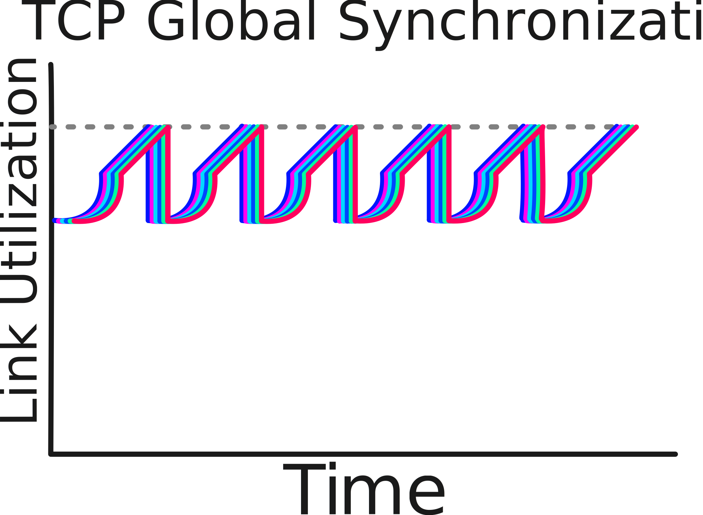

# Congestion

## Terms

**CC** --- Congestion Control

**AQM** --- Active Queue Management

Waiting for packets to be dropped when a queue is out of space causes global syncronization. 

**RED** --- Random Early Detection

Works based on a packet queue. If the queue is 100, RED starts at 30 packets and drop probability increases with queue depth.

**Incipient Congestion**

- Happens from multiplexing
- Statistical burst of traffic
- Sometimes packets, buffer or drop
- Irrespective of a long-term load

**Persistent Congestion**

- Over-Subscription
- Packet loss

**Congestion Collapse**

- Badly designed protocols react to congestion by trying to send faster or more often.

TCP's implementation of CC is responsible for the Internet not suffering from Congestion Collapse.

## TCP

- ECN is marked
- Dropped packets cause streams to slow down.

**Global Synchronization**

TCP on its own, will settle into this pattern, when the queues fill, multiple flows all speeding up and slowing down around the same period.

## References

[RFC 7567: IETF Recommendations Regarding Active Queue Management | RFC Editor](https://www.rfc-editor.org/info/rfc7567/)

[RFC 7141: Byte and Packet Congestion Notification | RFC Editor](https://www.rfc-editor.org/info/rfc7141/)

[Random Early Detection Gateways for Congestion Avoidance - 1993 IEEE](https://www.icir.org/floyd/papers/early.twocolumn.pdf)
