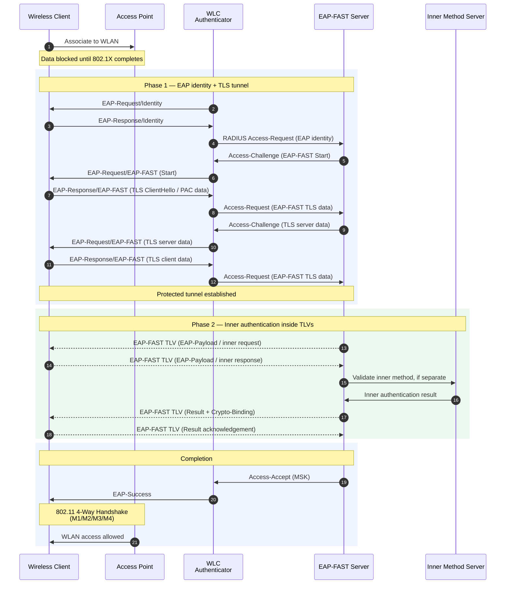

# EAP-FAST

**EAP-FAST** --- Flexible Authentication via Secure Tunneling

EAP-FAST is a tunneled EAP method defined in RFC 4851. It was developed by
Cisco as a replacement for LEAP: keep the username/password style deployment
model, but put weak inner credentials inside a mutually authenticated TLS
tunnel instead of exposing them to passive capture.

At a high level, EAP-FAST looks like PEAP:

- **Phase 1**, establishes or resumes a TLS tunnel between the peer and the
  EAP-FAST server.
- **Phase 2**, carries inner authentication data inside that tunnel using TLVs.
  The inner method can be another EAP method or other authentication data.

The distinctive EAP-FAST piece is the **Protected Access Credential (PAC)**.
A PAC can let the client and server resume or establish the tunnel from a
shared secret instead of requiring a traditional server-certificate-only PEAP
model every time.

PAC components:

- **PAC-Key**, shared secret used to derive TLS keying material.
- **PAC-Opaque**, opaque ticket data the peer returns to the server.
- **PAC-Info**, optional metadata useful to the peer.

## Notes

- The authenticator, EAP-FAST server, and inner method server are logical
  roles. They may be separate systems or collapsed into one device.
- RFC 4851 was published in 2007 and originally referenced TLS 1.0/1.1. Those
  versions are deprecated by RFC 8996, and TLS-based EAP methods were later
  updated for TLS 1.3 by RFC 9427.
- EAP-FAST provides fast reconnect, fragmentation, key derivation, replay
  protection, cryptographic binding, and dictionary attack protection.

## References

[RFC 4851: The Flexible Authentication via Secure Tunneling Extensible Authentication Protocol Method (EAP-FAST) | RFC Editor](https://www.rfc-editor.org/info/rfc4851/)

[RFC 8996: Deprecating TLS 1.0 and TLS 1.1 | RFC Editor](https://www.rfc-editor.org/info/rfc8996/)

[RFC 9427: TLS-Based Extensible Authentication Protocol (EAP) Types for Use with TLS 1.3 | RFC Editor](https://www.rfc-editor.org/info/rfc9427/)
