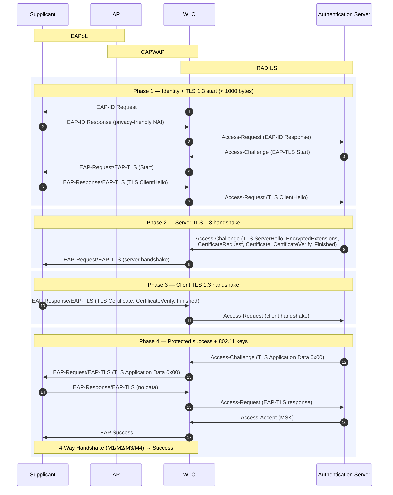

# EAP-TLS 1.3

I don't know if Cisco has this implemented. I saw the RFC and thought diagraming it would be neat.

RFC 9190 updates EAP-TLS for TLS 1.3. 

Compared to the [TLS 1.2 flow]:

[TLS 1.2 flow]: /eap/eap-tls-cisco-ise-and-wlc.md

- Server sends the handshake in one exchange
- Client certificate is encrypted
  - Client identity should be a privacy-friendly anonymous NAI (e.g. `@realm`)
- Server signals completion with a protected success indication
  -  one octet of TLS application data (`0x00`), before the cleartext EAP-Success

## References

[EAP-TLS 1.3 - RFC 9190: Using the Extensible Authentication Protocol with TLS 1.3 | RFC Editor](https://www.rfc-editor.org/info/rfc9190/)

[EAP-TLS - RFC 5216: The EAP-TLS Authentication Protocol | RFC Editor](https://www.rfc-editor.org/info/rfc5216/)
