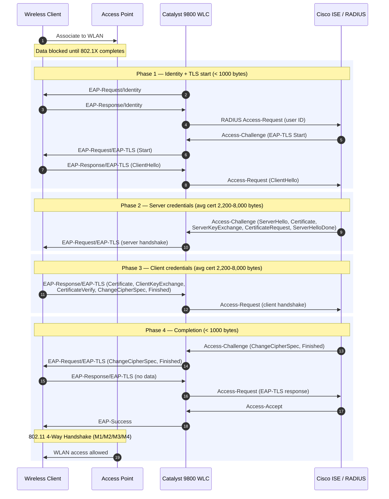

# EAP-TLS with Cisco ISE and WLC

This flow is pulled out of the [TACENT-2025] slides, with corrections to
Phase 3[^1] and Phase 4[^2]; the same flow is documented in this Cisco whitepaper, 
[Configure EAP-TLS on 9800 WLC with ISE Internal CA]. 

[TACENT-2025]: /pdfs/ciscolive/TACENT-2025.pdf
[Configure EAP-TLS on 9800 WLC with ISE Internal CA]: https://www.cisco.com/c/en/us/support/docs/wireless/catalyst-9800-series-wireless-controllers/222721-configure-eap-tls-on-9800-wlc-with-ise-i.html

[^1]: The slide lists "Server Key Exchange" in the client's Phase 3 flight;
    that is a typo for ClientKeyExchange --- in TLS 1.2 the client's flight is
    Certificate, ClientKeyExchange, CertificateVerify, ChangeCipherSpec,
    Finished (RFC 5246 §7.3).

[^2]: Phase 4 in TLS 1.2 is the server's ChangeCipherSpec + Finished. There is
    no protected success indication here --- that was added in EAP-TLS 1.3
    (RFC 9190).

## References

[Configure EAP-TLS on 9800 WLC with ISE Internal CA - Cisco](https://www.cisco.com/c/en/us/support/docs/wireless/catalyst-9800-series-wireless-controllers/222721-configure-eap-tls-on-9800-wlc-with-ise-i.html)

[EAP-TLS - RFC 5216: The EAP-TLS Authentication Protocol | RFC Editor](https://www.rfc-editor.org/info/rfc5216/)

[Cisco Live - Maximize Your 9800 Wireless Controller Capabilities: Troubleshoot 802.1x and Gain Radius Fragment Control with MTU - Carlos Socorro - TACENT-2025](/pdfs/ciscolive/TACENT-2025.pdf)
