# EAP

This page is kind of a mess, because the state of EAP in the industry is kind of a mess.

I started trying to understand the EAP methods from [this diagram](https://w1.fi/wpa_supplicant/devel/).

Most of these implementations are bespoke (they do not coexist well). The closest thing to a standard would be TEAP, which doesn't seem common.

## Terms

**EAP** --- Extensible Authentication Protocol

**EAPOL** --- Extensible Authentication Protocol over LANs

**TEAP** --- Tunneled Extensible Authentication Protocol

**PEAP** --- Protected Extensible Authentication Protocol

**Inner EAP**

EAP methods which should not be sent in clear text, but are still used by the
industry.

**802.1X** 

Port based network access control, usually implemented via EAP.

**Session-id**

- Uniquely identifies an authentication exchange

## Why are there so many versions of EAP

There are a few problems:

1. **End-to-End PKI is difficult and expensive**

   Reference standard EAP is probably EAP-TLS, but it's difficult and expensive, because end-to-end full certificate PKI is hard.

   Everything needs a x509 certificate:

   - The user's machine
   - APs
   - WLC
   - Authenticator (the RADIUS, or TACACS+ server)

   All these certificates need to be refreshed. They can't be issued indefinitely, and managing certificates is difficult and expensive.

2. **Active Directory Exists**

   What most organizations want to auth against isn't another database, but the database they already have, Windows Active Directory.
   
   The customer can be convinced to buy something like Cisco ISE, or implement FreeRADIUS so long as those products work with Active Directory.
   
   - EAP-MSCHAPv2
   
3. **Vendor Standards come to market faster**

   In the security space, where perception is part of the brand, being first to market matters. Interoperability is a distant second.
   
   - PEAP
   - LEAP
   - EAP-FAST
   
4. **"Why don't we just tunnel it"**

   Lots of EAP methods tunnel an existing method, over a more secure method. TEAP tries to solve this, but lots of vendor tunnel implementations exist.
   
   - EAP-TTLS
   - EAP-FAST

5. **"I gotta use this hardware I have"**

   MFA tokens, and SIM cards are frequently involved in the auth pathway.
   
   - EAP-GTC
   - EAP-SIM
   - EAP-AKA

6. **"I would be nice if the user could just type something in"**

   ... Becomes local implementations like

   - EAP-pwd

## EAP Implementations

| Method | Type | Spec | Why it exists |
|---|---|---|---|
| **EAP-MD5** | 4 | RFC 3748 §5.4 | The original placeholder. Simple CHAP-style challenge over EAP. No mutual auth, no key derivation, so it can't produce keys for WPA. Exists only because EAP needed a trivial reference method in the base spec. Dead for wireless. |
| **EAP-OTP** | 5 | RFC 3748 §5.5 | One-Time Password. Carries RFC 2289-style OTP challenges. Exists to bridge EAP to 1990s token systems. Effectively never deployed standalone. |
| **EAP-GTC** | 6 | RFC 3748 §5.6 | Generic Token Card. Deliberately dumb: send a prompt, get a cleartext string back. Exists as a transport for *anything* — RSA SecurID, LDAP passwords, OTP — which is why it survives as a **PEAP/FAST/TEAP inner method** where the tunnel provides the protection it lacks. |
| **EAP-TLS** | 13 | RFC 5216 (obs. RFC 2716); TLS 1.3 in RFC 9190 | The "correct" answer. Mutual certificate authentication, strong key derivation, no passwords anywhere. Exists because 802.11 needed a real, keying-capable method. Its only problem is that it demands a PKI and a cert on every endpoint. |
| **LEAP** | 17 | None — Cisco proprietary | Cisco's 2000-era stopgap so customers could do 802.1X with just AD passwords, no PKI. Mutual auth via MS-CHAP challenge/response in the clear. Broken by asleap in 2003. Exists in your diagram purely as history. |
| **EAP-SIM** | 18 | RFC 4186 | Authenticates using GSM SIM credentials and the A3/A8 algorithms. Exists so carriers could offload subscribers onto Wi-Fi using the SIM they already issued, instead of provisioning a second credential. |
| **EAP-TTLS** | 21 | RFC 5281 | Funk/Certicom's answer to "TLS is right but client certs are painful." Server-side cert builds the tunnel, then runs *legacy non-EAP* inner protocols — PAP, CHAP, MS-CHAPv2 — which matters because it lets you check a plaintext password against a backend that can't do EAP (LDAP, token servers). |
| **EAP-AKA** | 23 | RFC 4187 | The 3G successor to EAP-SIM using the USIM AKA algorithm. Exists because GSM's A3/A8 was weak and lacked network authentication. |
| **PEAP** | 25 | **No RFC** — expired IETF drafts; Microsoft [MS-PEAP], Cisco PEAPv1 | Microsoft/Cisco/RSA's parallel answer to the same problem TTLS solved, invented at the same time and never standardized. Server cert builds a tunnel, then runs *EAP* methods inside. Won on deployment because it shipped in Windows. The reason PEAPv0 and PEAPv1 both exist is that Microsoft and Cisco couldn't agree on the inner protocol. |
| **EAP-MSCHAPv2** | 29 | **No RFC** as an EAP method — MS-CHAPv2 itself is RFC 2759; EAP wrapper is an expired draft | Wraps Microsoft's challenge/response so a domain password can be verified against AD without the AD side changing. Exists because everyone already had AD. Cryptographically broken standalone (DES reduction, 2012) — survives only as a PEAP/TTLS/TEAP inner method. |
| **EAP-FAST** | 43 | RFC 4851; PAC provisioning in RFC 5422 | Cisco's LEAP replacement. Same tunnel idea as PEAP/TTLS, but the tunnel can be built from a pre-shared **PAC** instead of a server certificate — the whole point was "TLS security without deploying a PKI." The PAC provisioning problem is what made it a support burden. |
| **EAP-PAX** | 46 | RFC 4746 (Informational) | Password Authenticated eXchange. An academic-flavored attempt to get mutual auth and keying from a *weak shared password* with no tunnel and no PKI at all. Exists as a research answer to "why do we need TLS just to use a password?" Essentially never deployed. |
| **EAP-PSK** | 47 | RFC 4764 (Experimental) | Pre-shared key method built on AES only — no TLS, no certificates, no hash zoo. Exists as a minimal, auditable, single-primitive method for constrained devices. Also basically never deployed. |
| **EAP-AKA'** | 50 | RFC 5448, obsoleted by RFC 9048 | Adds key separation binding the derived keys to the access network name. Fixes a real AKA weakness; mandatory for 5G. |
| **EAP-pwd** | 52 | RFC 5931 | Password method using a dragonfly key exchange — resists dictionary attack with no PKI and no tunnel. Related to WPA3's SAE. |
| **TEAP** | 55 | RFC 9930; obsoletes RFC 7170 | The IETF's attempt to finally standardize the tunnel and end the PEAP/TTLS/FAST fork. Adds **EAP chaining** — machine *and* user in one session — which nothing else does. This is why it exists and why it's the only one still gaining ground. |
| **EAP-TLS 1.3** | 13 | RFC 9190 | Not a new method — EAP-TLS re-specified for TLS 1.3, which changes key derivation and encrypts the client certificate. RFC 9427 does the same rework for TTLS, PEAP, FAST and TEAP. |

## EAP Type Progression

EAP is a framework, not one authentication mechanism. The overlap mostly comes
from TLS tunneling: PEAP, EAP-FAST, and TEAP all build a protected tunnel
first, then run some inner authentication inside it.

```mermaid
graph TD
    eap["EAP framework"]

    eap --> legacy["legacy / direct password methods"]
    legacy --> md5["EAP-MD5"]
    legacy --> leap["LEAP"]

    eap --> cert["certificate-based TLS"]
    cert --> tls["EAP-TLS"]
    tls --> tls13["EAP-TLS 1.3"]

    eap --> tunneled["tunneled TLS methods"]
    tunneled --> peap["PEAP"]
    peap --> peapMschap["PEAP / EAP-MSCHAPv2"]
    peap --> peapGtc["PEAP / EAP-GTC"]
    peap --> peapTls["PEAP / EAP-TLS"]

    tunneled --> fast["EAP-FAST"]
    fast --> fastMschap["EAP-FAST / EAP-MSCHAPv2"]
    fast --> fastGtc["EAP-FAST / EAP-GTC"]
    fast --> fastTls["EAP-FAST / EAP-TLS"]
    fast --> fastChaining["EAP-FAST chaining"]

    tunneled --> teap["TEAP"]
    teap --> teapTls["TEAP / EAP-TLS"]
    teap --> teapMschap["TEAP / EAP-MSCHAPv2"]
    teap --> teapChaining["TEAP chaining"]

    eap --> simBased["SIM / mobile network methods"]
    simBased --> sim["EAP-SIM"]
    simBased --> aka["EAP-AKA / EAP-AKA'"]

    eap --> pwdBased["password-authenticated key exchange"]
    pwdBased --> pwd["EAP-PWD"]

    style md5                   fill:#ddd,color:#aaa,stroke:#ccc
    style leap                  fill:#ddd,color:#aaa,stroke:#ccc
    style sim                   fill:#ddd,color:#aaa,stroke:#ccc
    style aka                   fill:#ddd,color:#aaa,stroke:#ccc
    style pwd                   fill:#ddd,color:#aaa,stroke:#ccc
    style tls                   fill:#1a4a6b,color:#fff,stroke:#1a4a6b
    style tls13                 fill:#1a4a6b,color:#fff,stroke:#1a4a6b
    style peap                  fill:#1a4a6b,color:#fff,stroke:#1a4a6b
    style peapMschap            fill:#1a4a6b,color:#fff,stroke:#1a4a6b
    style peapGtc               fill:#1a4a6b,color:#fff,stroke:#1a4a6b
    style peapTls               fill:#1a4a6b,color:#fff,stroke:#1a4a6b
    style fast                  fill:#1a4a6b,color:#fff,stroke:#1a4a6b
    style fastMschap            fill:#1a4a6b,color:#fff,stroke:#1a4a6b
    style fastGtc               fill:#1a4a6b,color:#fff,stroke:#1a4a6b
    style fastTls               fill:#1a4a6b,color:#fff,stroke:#1a4a6b
    style fastChaining          fill:#1a4a6b,color:#fff,stroke:#1a4a6b
    style teap                  fill:#1a4a6b,color:#fff,stroke:#1a4a6b
    style teapTls               fill:#1a4a6b,color:#fff,stroke:#1a4a6b
    style teapMschap            fill:#1a4a6b,color:#fff,stroke:#1a4a6b
    style teapChaining          fill:#1a4a6b,color:#fff,stroke:#1a4a6b
```

## References

[EAP - RFC 3748: Extensible Authentication Protocol | RFC Editor](https://www.rfc-editor.org/info/rfc3748/)

[EAP-FAST - RFC 4851: The Flexible Authentication via Secure Tunneling Extensible Authentication Protocol Method | RFC Editor](https://www.rfc-editor.org/info/rfc4851/)

[EAP-TLS - RFC 5216: The EAP-TLS Authentication Protocol | RFC Editor](https://www.rfc-editor.org/info/rfc5216/)

[TEAP - RFC 9930: Tunnel Extensible Authentication Protocol Version 1 | RFC Editor](https://www.rfc-editor.org/info/rfc9930/)

[RFC 4017: Extensible Authentication Protocol (EAP) Method Requirements for Wireless LANs | RFC Editor](https://www.rfc-editor.org/info/rfc4017/)

[TEAP - HPE Aruba Networking Tech Corner](https://arubanetworking.hpe.com/techdocs/NAC/tech-corner/teap/)

[Authentication protocol - Wikipedia](https://en.wikipedia.org/wiki/Authentication_protocol)

[Extensible Authentication Protocol - Wikipedia](https://en.wikipedia.org/wiki/Extensible_Authentication_Protocol)

[FreeRADIUS Community](https://www.freeradius.org/community/)

[Extensible Authentication Protocol (EAP) Registry](https://iana.org/assignments/eap-numbers)

