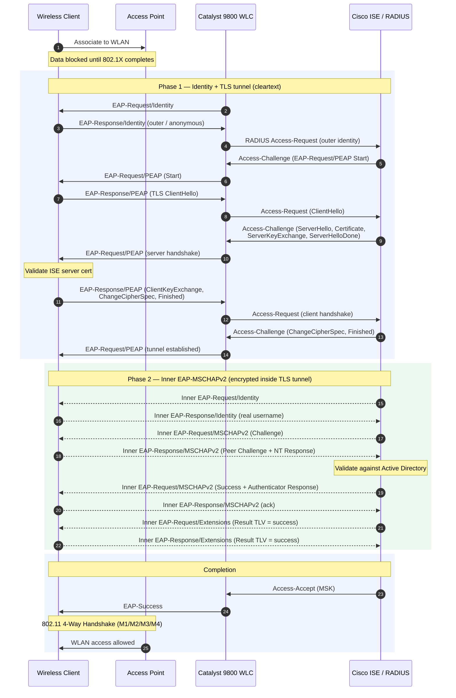

# PEAP-MSCHAPv2 with ISE and C9800

**PEAP** --- Protected Extensible Authentication Protocol

ISE uses a certificate, the clients authenticate with a username and password against active directory.

It has two phases:

- **Phase 1** builds a TLS tunnel, much like the HTTPS handshake. The client
  validates ISE's server certificate but does not present one of its own.

- **Phase 2** runs a second, inner EAP conversation --- EAP-MSCHAPv2 ---
  entirely *inside* that tunnel, so the username and the challenge/response are
  encrypted on the wire.

The outer identity in Phase 1 can be anonymous (e.g. `anonymous`); the real
username is only sent inside the tunnel in Phase 2.

## References

[Demystifying PEAP-MSCHAPv2 Packet Flow with Wireshark - Cisco Community](https://community.cisco.com/t5/security-blogs/demystifying-peap-mschapv2-packet-flow-with-wireshark/ba-p/5145121)

[Catalyst 9800 Software Configuration Guide - 802.1x Support (EAP-TLS and EAP-PEAP) - Cisco](https://www.cisco.com/c/en/us/td/docs/wireless/controller/9800/17-9/config-guide/b_wl_17_9_cg/m_801x_support_eap-tls_and_eap-peap-neat.html)

[RFC 2759: Microsoft PPP CHAP Extensions, Version 2 (MSCHAPv2) | RFC Editor](https://www.rfc-editor.org/info/rfc2759/)
