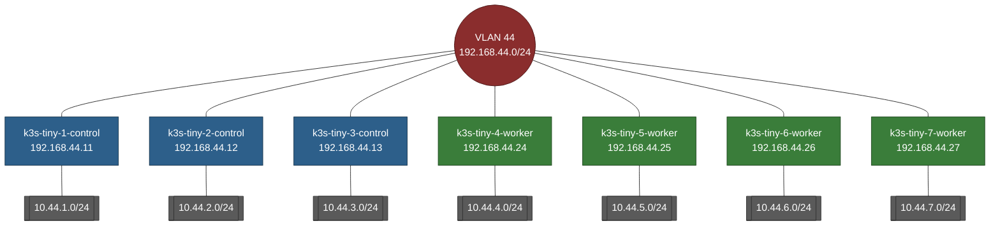

# Flannel change the spec.podCIDR subnets

> [!WARNING]
> This is involved and non-trivial. It is a completely unsupported path.

> [!CAUTION]
> `spec.podCIDR` cannot be modified. It must be removed then added back.

Normally, flannel encapsulates the pod packets inside of VXLAN ... but if you have a layer 2 setup, you don't need VXLAN.

My Kubernetes Equipment VLAN: `192.168.44.0/24`

I realized I wanted this IP scheme after I had already deployed Kubernetes :/

| Hostname           | Node IP       | Subnet       |
|--------------------|---------------|--------------|
| k3s-tiny-1-control | 192.168.44.11 | 10.44.1.0/24 |
| k3s-tiny-2-control | 192.168.44.12 | 10.44.2.0/24 |
| k3s-tiny-3-control | 192.168.44.13 | 10.44.3.0/24 |
| k3s-tiny-4-worker  | 192.168.44.24 | 10.44.4.0/24 |
| k3s-tiny-5-worker  | 192.168.44.25 | 10.44.5.0/24 |
| k3s-tiny-6-worker  | 192.168.44.26 | 10.44.6.0/24 |
| k3s-tiny-7-worker  | 192.168.44.27 | 10.44.7.0/24 |

## No VXLAN - using host-gw

`host-gw` turns on plain layer 3 routing.

This removes a tremendous amount of container networking complexity.

### Console

```console
ariadne@k3s-worker-tiny-5:~$ ip route
default via 192.168.44.1 dev eth0 proto static 
10.44.1.0/24 via 192.168.44.11 dev eth0 
10.44.2.0/24 via 192.168.44.12 dev eth0 
10.44.3.0/24 via 192.168.44.13 dev eth0 
10.44.4.0/24 via 192.168.44.24 dev eth0 
10.44.5.0/24 dev cni0 proto kernel scope link src 10.44.5.1 
10.44.6.0/24 via 192.168.44.26 dev eth0 
10.44.7.0/24 via 192.168.44.27 dev eth0 
192.168.44.0/24 dev eth0 proto kernel scope link src 192.168.44.25 
```

### Graphed



## Prerequisites

- K3S
- All K3S nodes on the same VLAN
- No firewall between nodes
- SSH access to every node
- 3 control nodes, to keep quorum
- Backups or nothing important on this cluster

## Migration Plan

1. Back up first
2. Update Flannel
3. Restart K3S
4. Reassign each Pod CIDR
5. Verify the new allocation
6. Verify traffic
7. Clean up stale routes

## Step-by-Step

### 1. Back up first

I made backups of my VMs.

### 2. Update Flannel

This does a few things:

- Specifies the network plan for this cluster
- Turns off VXLAN
- Turns off auto allocation

`/etc/rancher/k3s/config.yaml`

These are the values to add.

```yaml,editable
flannel-backend: host-gw
cluster-cidr: 10.44.0.0/16
kube-controller-manager-arg:
  - allocate-node-cidrs=false
```

This file doesn't always already exist, if it doesn't you can use this.

```console,editable
sudo tee -a /etc/rancher/k3s/config.yaml >/dev/null <<'EOF'
flannel-backend: host-gw
cluster-cidr: 10.44.0.0/16
kube-controller-manager-arg:
  - allocate-node-cidrs=false
EOF
```

### 3. Restart K3S

- Restart one control node at a time
- Wait until back to 3 of 3 quorum

```console
sudo systemctl restart k3s
```

### 4. Reassign each Pod CIDR

`spec.podCIDR` cannot be modified. It must be removed then added back.

**On the node** --- SSH or Console

**Via API** --- Point at a control node that has quorum 

- This is performed in sequence, one node at a time
- This is eventually performed on all nodes
- Changes made via API must always be to a control node with quorum
- This is slow and tedious

> [!TIP]
> For this example I'm modifying `k3s-tiny-1-control` so I point the API at `k3s-tiny-2-control`

1. **On the node - Stop K3s and delete the old CNI info**

   ```console,editable
   sudo systemctl stop k3s          # controllers
   sudo systemctl stop k3s-agent    # workers
   sudo ip link del cni0            # still holds the OLD gateway IP
   sudo rm -rf /var/lib/cni/*
   sudo rm -f /run/flannel/subnet.env
   sudo ip link del flannel.1 2>/dev/null   # leftover VXLAN device, if present
   ```

1. **Via API - Delete the Node object**

   Necessary to remove `podCIDR`.

   > [!CAUTION]
   > Delete the node you're repinning --- never the controller you pointed the
   > API at. Deleting the wrong controller evicts a *healthy* etcd member. Do
   > that while another controller is already down and you drop below quorum.

   ```console,editable
   kubectl delete node k3s-tiny-1-control \
     --server=https://k3s-tiny-2-control:6443 \
     --insecure-skip-tls-verify
   ```

1. **(If controller) On the node - Move etcd**

   We are going to re-join this node later. This etcd won't be used.

   ```console,editable
   sudo mv /var/lib/rancher/k3s/server/db/etcd \
           /var/lib/rancher/k3s/server/db/etcd.removed-$(date +%s)
   ```

1. **On the node - Start K3s**

   The device should re-join.
   
   K3S has settings for this in:
   
   - `/etc/systemd/system/k3s.service` or
   - `/etc/rancher/k3s/config.yaml`

   ```console,editable
   sudo systemctl start k3s
   ```

1. **Via API - Wait for it to re-register with an empty PODCIDR**

   ```console,editable
   kubectl get node k3s-tiny-1-control \
     -o jsonpath='{.spec.podCIDR}{"\n"}' \
     --server=https://k3s-tiny-2-control:6443 \
     --insecure-skip-tls-verify
   ```

1. **Via API - Patch the exact CIDR you want**

   ```console,editable
   kubectl patch node k3s-tiny-1-control --type=merge \
     -p '{"spec":{"podCIDR":"10.44.1.0/24","podCIDRs":["10.44.1.0/24"]}}' \
     --server=https://k3s-tiny-2-control:6443 \
     --insecure-skip-tls-verify
   ```

### 5. Verify the new allocation

Each node should receive a unique `/24` from `10.44.0.0/16`.

Check the node annotations and routes on every machine.

```console
kubectl get nodes -o wide
ip route | grep 10.44
```

### 6. Verify traffic

Test three paths:

- pod to pod on different nodes
- pod to ClusterIP
- pod to API VIP or external service

Use temporary test pods and remove them afterward.

### 7. Clean up stale routes

You might have to clean up old routes.

Log into each node and check.

See the [example].

[example]: #console

**Log into each node and check for sanity**

```console
ip route
```

**To delete**

```console
sudo ip route del 10.44.9.0/24
```

## References

[Flannel - VXLAN](flannel-vxlan.md)

[K8s on Debian - Initial Setup](k8s-on-debian-initial-setup.md)
