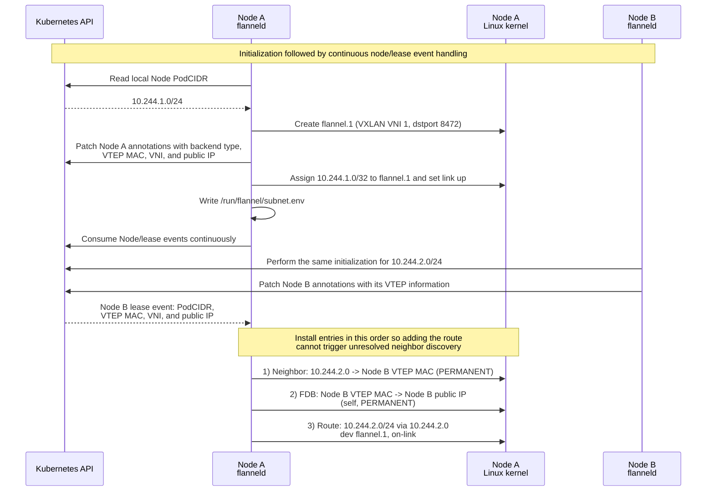
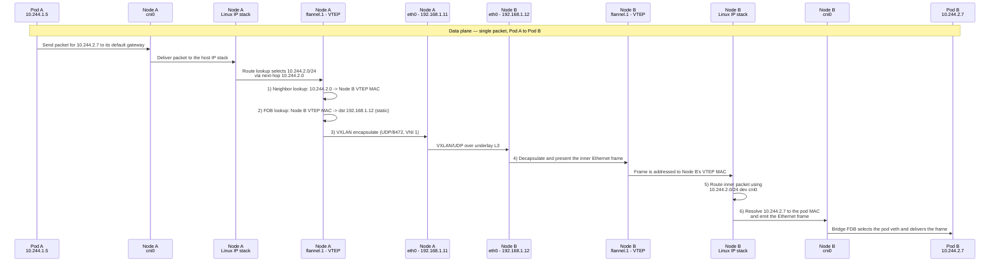

# Flannel VXLAN

I want to understand what I'm implementing. I started with this. I did not implement it.

I went with `host-gw` for backend.

Flannel v0.28.5:

- backend: Linux VXLAN
- interface: flannel.1
- VNI: 1
- port: UDP/8472
- directRouting: disabled

## Control Plane

## Data Plane

`cni0` and the pod `veth` interfaces are created by the CNI bridge plugin, not by
Flannel. 

This example also assumes IP forwarding and the required firewall
policy are already in place.

## References

[Flannel v0.28.5 release](https://github.com/flannel-io/flannel/releases/tag/v0.28.5)

[Flannel v0.28.5 VXLAN backend - vxlan.go](https://github.com/flannel-io/flannel/blob/v0.28.5/pkg/backend/vxlan/vxlan.go)

[Flannel v0.28.5 VXLAN network event handling - vxlan_network.go](https://github.com/flannel-io/flannel/blob/v0.28.5/pkg/backend/vxlan/vxlan_network.go)

[Flannel v0.28.5 VXLAN device implementation - device.go](https://github.com/flannel-io/flannel/blob/v0.28.5/pkg/backend/vxlan/device.go)

[Flannel v0.28.5 Kubernetes subnet manager - kube.go](https://github.com/flannel-io/flannel/blob/v0.28.5/pkg/subnet/kube/kube.go)
