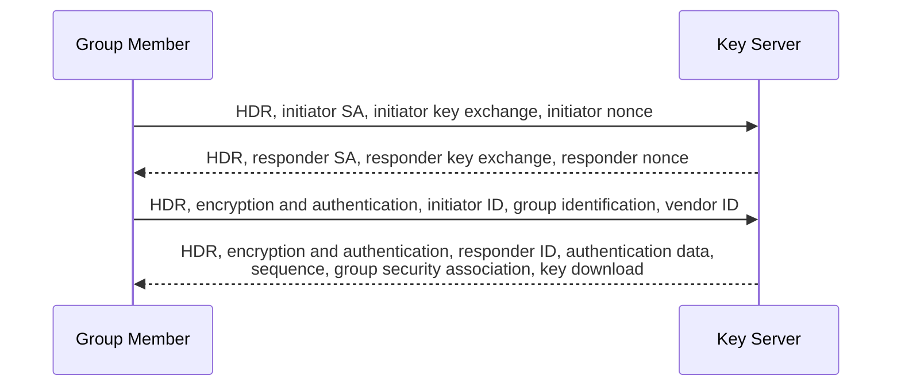

# GETVPN

- One SA
- Any-to-Any
- No tunnels
  - Does not change the IPs
  - IPSEC Tunnel mode with Address Preservation
    - Works well with QoS or Traffic Engineering
- Replicates multicast well

HIPAA, GLBA, and PCI DSS all mandate encryption even over private IP networks.

DMVPN is OK, but requires an overlay, with additional complexity.

Point-to-point IPSec tunnels are poor at multicast replication, because the multicast must be replicated before it enters the tunnel.

## Terms

**GETVPN** --- Group Encrypted Transport VPN

**GDOI** --- Group Domain of Interpretation

- Implements IKE

**G-IKEv2**

- Replaces GDOI

**GM** --- Group Member

- All share the same crypto SA

**KS** --- Key Server

**TEK** --- Traffic Encryption Key

**KEK** --- Key Encryption Key

- Control plane traffic

### G-IKEv2

**Message Exchange**

### Migration help

[Walkthrough](https://www.cisco.com/c/en/us/td/docs/routers/ios-xe/security-vpn/security-vpn/m_sec-get-vpn-gikev2.html)

## References

[Group Encrypted Transport VPN (GETVPN) Design and Implementation Guide](/pdfs/GETVPN_DIG_version_2_0_External.pdf)

[Security and VPN Configuration Guide - GETVPN G-IKEv2 Support - Cisco](https://www.cisco.com/c/en/us/td/docs/routers/ios-xe/security-vpn/security-vpn/m_sec-get-vpn-gikev2.html)

[Group Encrypted Transport VPN - Cisco](https://www.cisco.com/c/en/us/support/security/group-encrypted-transport-vpn/series.html)

[GETVPN Troubleshoot Guide - Cisco](https://www.cisco.com/c/en/us/support/docs/security/group-encrypted-transport-vpn/118125-technote-getvpn-00.html)

[RFC 9838: Group Key Management Using the Internet Key Exchange Protocol Version 2 (IKEv2) | RFC Editor](https://www.rfc-editor.org/info/rfc9838/)

[RFC 7296: Internet Key Exchange Protocol Version 2 (IKEv2) | RFC Editor](https://www.rfc-editor.org/info/rfc7296/)

[RFC 6407: The Group Domain of Interpretation | RFC Editor](https://www.rfc-editor.org/info/rfc6407)

