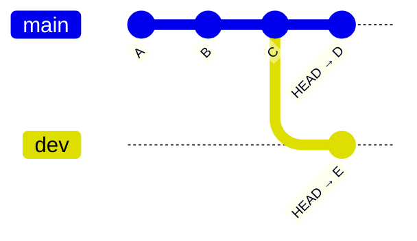
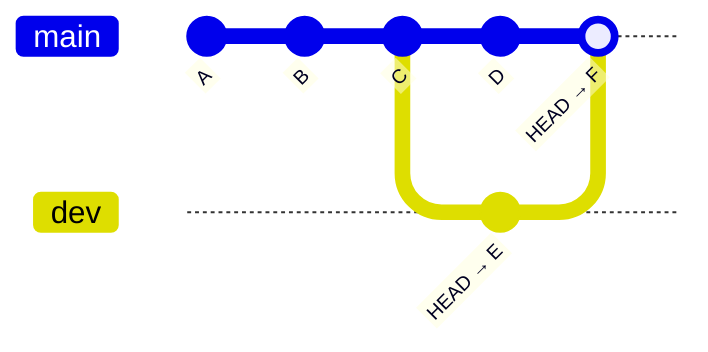
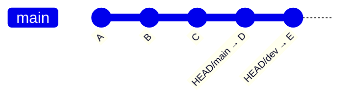
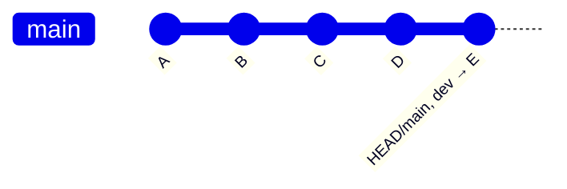

# Git Rebase

> [!CAUTION]
>
> `rebase` modifies history.
>
> Do not rebase commits that others may have based work on.

Two branches, the start.



Normally, with two branches, we'd do a `merge`

**After the `merge`**



`F` is the commit the combines the diff **of the endpoints of the branches** `main` and `dev`.

The `dev` branch is just hanging out.

***

**What a rebase does.**


Finding the common ancestor to both branches, `C` we go "This is the common base, just play the diffs forward from both branches onto `main`"

```console
git checkout dev
git rebase main
```



Now the `HEAD` for two branches `main` and `dev` are on the same branch. Main can be FF'd to move the `HEAD`.

```console
git checkout main
git merge dev
```



# References
[Git - Rebasing](https://git-scm.com/book/en/v2/Git-Branching-Rebasing)

[Git - git-rebase Documentation](https://git-scm.com/docs/git-rebase)
