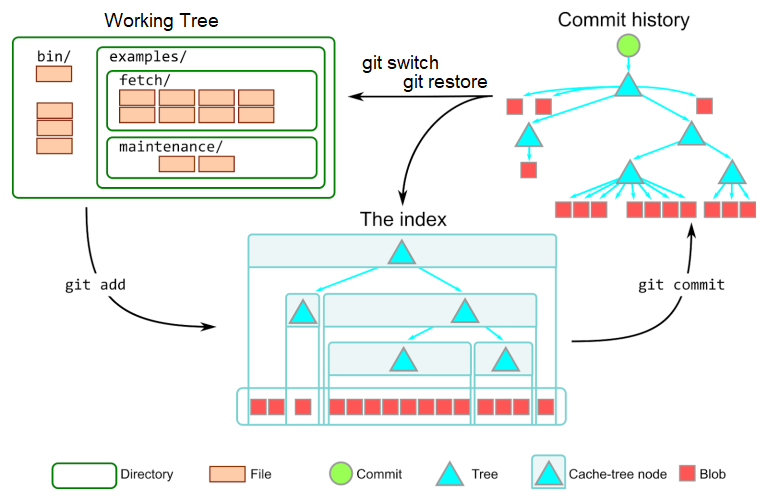
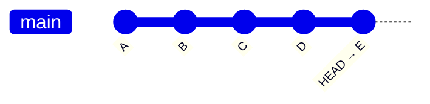
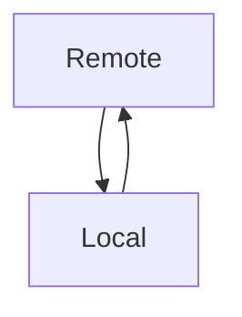
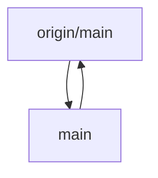
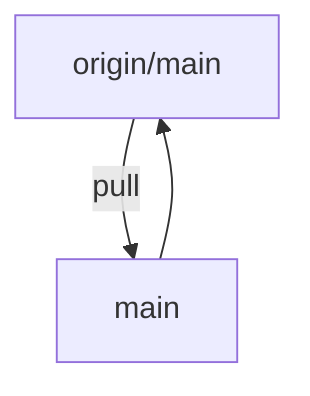
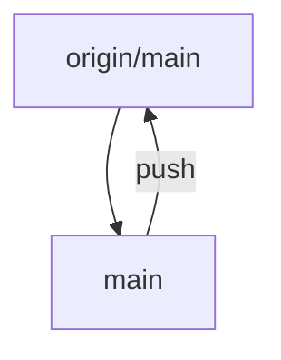
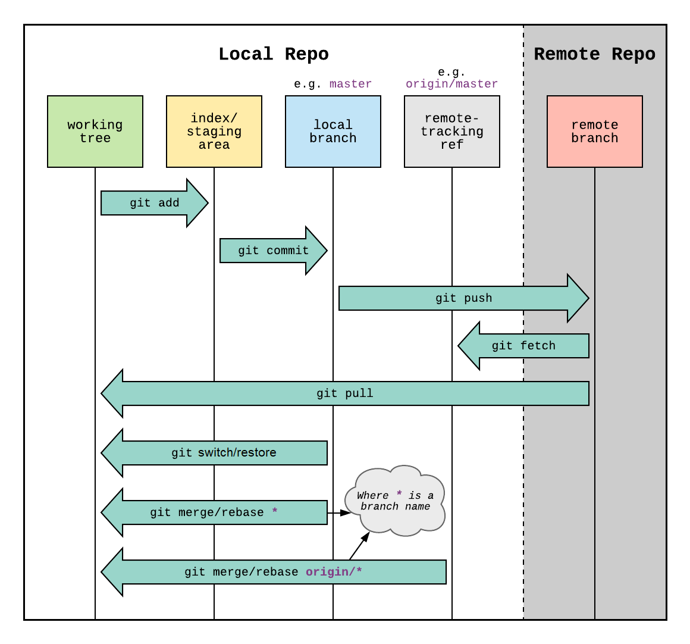

# Use Git

Git is a collaborative code tool. It allows distributed development, with yourself or others.

The database that holds the code, the history of changes to the code is a **repository**.

Previous version control tools used diffs, which are changes or deltas between files "lines 38 to 42 have changed", Git is snapshot based.

Every file being tracked is hashed with SHA-1, each and every time a commit is made. Git always knows if files have been changed.

The list of files and their hashes is called the **Index.**

## Terms

### Repository

- `.git/`
- AKA, Repo
- AKA, the object store
- Content Addressable Filesystem
- Key-value based. All of Git is key-value
- De-Duplicated. If two files have the same SHA-1, git stores 1 blob
  - Git stores: blobs, trees, commits, and tags
- Interacted with almost purely via `git`

### Commits

- Takes a snapshot of the current Index
- SHA-1 entity that points to a specific tree
- Metadata: author, commiter, timestamp, messages, parent commit
- Commits are backwards chains
  - All commits store the hash of previous commits

### Tree

- A directory snapshot
  - Mode (file type and permissions)
  - Name (file or directory)
  - SHA-1 (the hash)
  - Trees point to blobs and other trees
  
### Blob

- A key-value pair that represents a file
- `82da472f6d00dc5f0a651f33ebb320aa9c7b08d0  LICENSE`
- The SHA-1 is used to find the compressed content of `LICENSE`

### Branch

- A named pointer to a specific commit
- Commits are stored as nodes on a [DAG]
- Merge commits have two or more parents
- The init commit has no parents

### HEAD

- A named pointer to the current branch
- In detached HEAD state, points directly to a commit
- Works like the playhead on a tapedeck

### Working tree

- AKA, project directory
- AKA, user directory
- AKA, your files
- This is where project files are modified
- Directory inside `git init` was ran

### The index

- `.git/index`
- AKA, staging
- AKA, cache
- AKA, pre-commit
- AKA, git's files
- Invoked with `git add`
- Adding a file does two things:
  - SHA-1 of the file, adding it to the Index
  - Writes the blob to .git/objects/
- Files in the Index are tracked

## Local files overview

Git tries to avoid touching working tree files. When a file is added, a snapshot is taken at that time.



Image courtesy of [Derrick Stolee].

## Branch example



`A`, `B`, `C`, `D` are previous commits.

The working tree contains the files from commit `E`.

I think of it like a tape deck, the `HEAD` can be played backwards or forwards.

`commit` moves the `HEAD` forward, and `reset` moves the `HEAD` backwards.

## Remote and local overview

A basic example: a local repo, and a remote repo.



The default reference for the remote repo is `origin`.

Local branches are referenced by name e.g. `main`



### Pull

To update the local repo to match the remote, use `pull`



```console
git pull
```

### Push

To update the remote repo to match the local, use `push`



```console
git push
```

## Git operations



[image courtesy of Reddit]

## References

[DAG]: https://en.wikipedia.org/wiki/Directed_acyclic_graph

[Git - User-Manual Documentation](https://git-scm.com/docs/user-manual.html)

[Derrick Stolee]: https://github.blog/open-source/git/make-your-monorepo-feel-small-with-gits-sparse-index/

[image courtesy of Reddit]: https://www.reddit.com/r/git/comments/99ul9f/git_workflow_diagram_showcasing_the_role_of/
