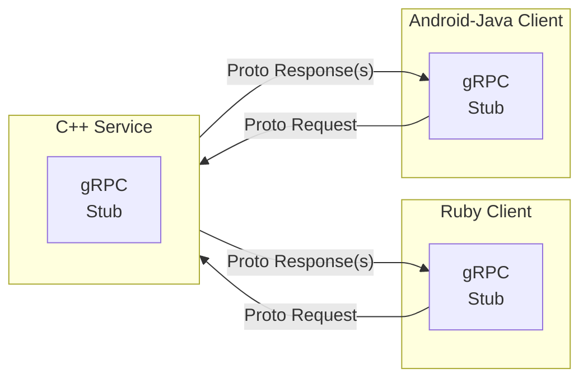

# gRPC

A Google Invention.

- Uses HTTP/2 as transport.
- Client - Server Oriented.
- gRPC clients talk to gRPC servers.

Programs can do remote function calls on other servers.



## Protocol buffers

This defines the data structure to send.

- Small local records

- Messages
- end in `.proto`

```console
message Person {
  string name = 1;
  int32 id = 2;
  bool has_ponycopter = 3;
}
```

... Gets fed into the protocol buffer compiler `protoc`

Allows `name()`, `set_name()`


Now the `Person` class can serialize and retrieve protocol buffer messages.


## References

[Introduction to gRPC | gRPC](<https://grpc.io/docs/what-is-grpc/introduction/>)
