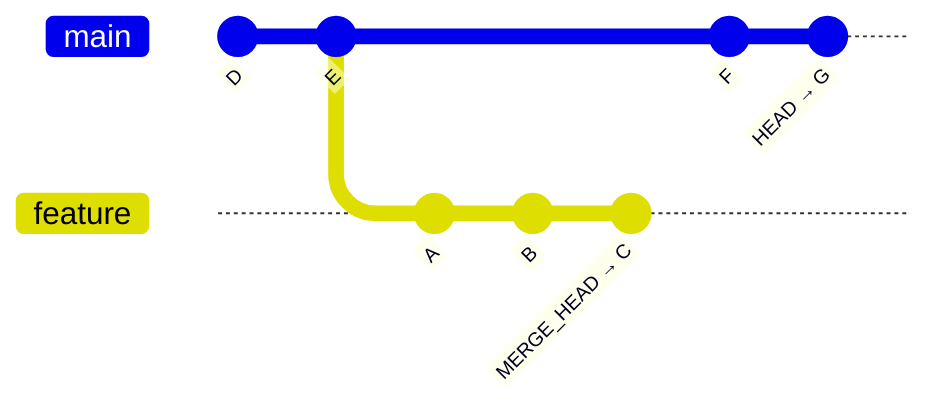
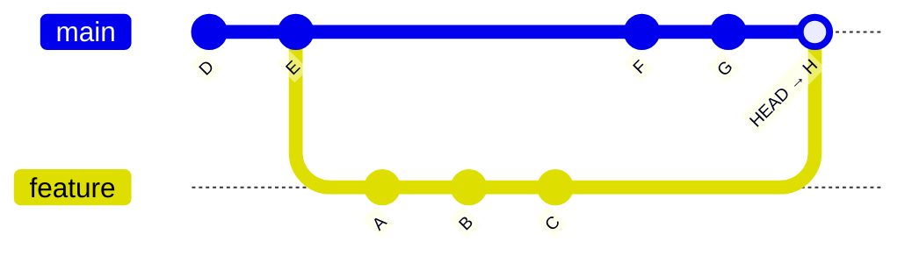
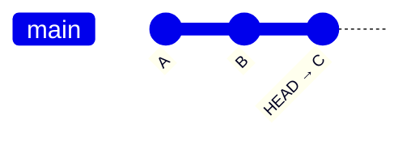
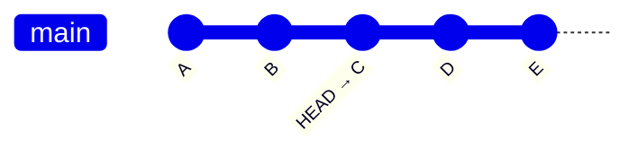
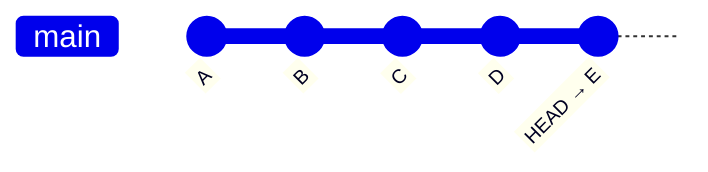

# Merge

> [!WARNING]
> Do not perform `pull` or a `merge` with uncommitted changes.
>
> `merge` is designed to combine **committed** changes. You can lose work.

## How does merge work

`E` is the last shared commit.

`Merge` will play back the commits on both branches. If neither set of commits touches the same parts of the file, the branches are merged, and `HEAD` moves to the end.



After the `merge`



## Merge types

### Fast forward

The default `merge` is called fast forward, or FF.

FF can be used when there are no local changes or local commits.

The repo was `cloned` previously.

Before `fetch`.



After `fetch`.



After `merge`.

```plain
git merge origin/main
```



***

### Pull

`pull` combines `fetch` and `merge`. `pull` assumes a fast forward `merge`.

Before `pull`.


After `pull`.


### True merge

This happens trying to update the part of a file, someone else has already updated.

1. `HEAD` pointer stays the same

1. `MERGE_HEAD` pointer on the branch to be merged.

1. What can be merged cleanly is merged.

1. Index records three versions of the files. `Ancestor`, `HEAD` and `MERGE_HEAD`
   - Files are merged in the working directory with conflict markers `<<<<<<`, `=======`, >>>>>>`

1. A ref called `AUTO_MERGE` gets created.

## Conflict resolution

After the `merge`, Git will say what files need to be resolved. This is called **Conflict Resolution.**

To resolve:

1. Open the file.
1. Find the Markers.
1. Delete lines you don't want.
1. Delete the markers.

### Two way conflict

In Conflict.

```plain
                   Here are lines that are either unchanged from the common        
                   ancestor, or cleanly resolved because only one side changed,    
                   or cleanly resolved because both sides changed the same way.    
                   <<<<<<< yours:sample.txt                                        
Your change  ┌───  Conflict resolution is hard;                                    
             └───  let's go shopping.                                              
                   =======                                                         
    Theirs    ───  Git makes conflict resolution easy.                             
                   >>>>>>> theirs:sample.txt                                       
                   And here is another line that is cleanly resolved or unmodified.
```

Resolved, kept local change.

```plain
                   Here are lines that are either unchanged from the common        
                   ancestor, or cleanly resolved because only one side changed,    
                   or cleanly resolved because both sides changed the same way.    
Your change  ┌───  Conflict resolution is hard;                                    
             └───  let's go shopping.                                              
                   And here is another line that is cleanly resolved or unmodified.
```

### Three way conflict

`zdiff3` shows the conflict with the original text, adding the `|||||||` marker.

In Conflict

```plain
                 Here are lines that are either unchanged from the common        
                 ancestor, or cleanly resolved because only one side changed,    
                 or cleanly resolved because both sides changed the same way.    
                 <<<<<<< yours:sample.txt                                        
      Yours ┌──  Conflict resolution is hard;                                    
            └──  let's go shopping.                                              
                 ||||||| base:sample.txt                                         
Original    ┌──  or cleanly resolved because both sides changed identically.     
 (Ancestor) └──  Conflict resolution is hard.                                    
                 =======                                                         
     Theirs  ──  Git makes conflict resolution easy.                             
                 >>>>>>> theirs:sample.txt                                       
                 And here is another line that is cleanly resolved or unmodified.
```

Resolved, kept their lines.

```plain
                 Here are lines that are either unchanged from the common        
                 ancestor, or cleanly resolved because only one side changed,    
                 or cleanly resolved because both sides changed the same way.    
     Theirs  ──  Git makes conflict resolution easy.                             
                 And here is another line that is cleanly resolved or unmodified.
```

### Conflicts resolved

This will also check the merge status.

```plain
git merge --continue
```

### Abort A merge

```plain
merge --abort
```

## References

[Git - git-merge Documentation](https://git-scm.com/docs/git-merge)
