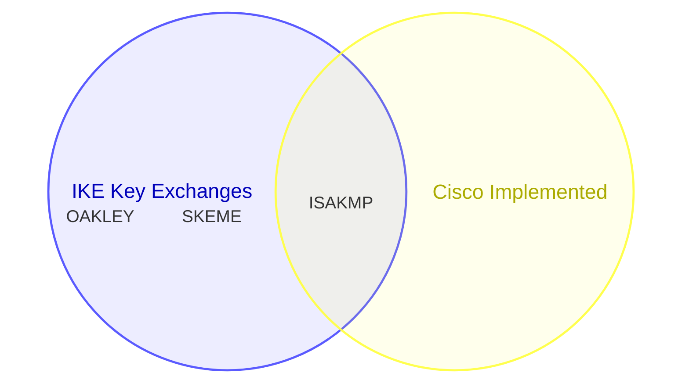
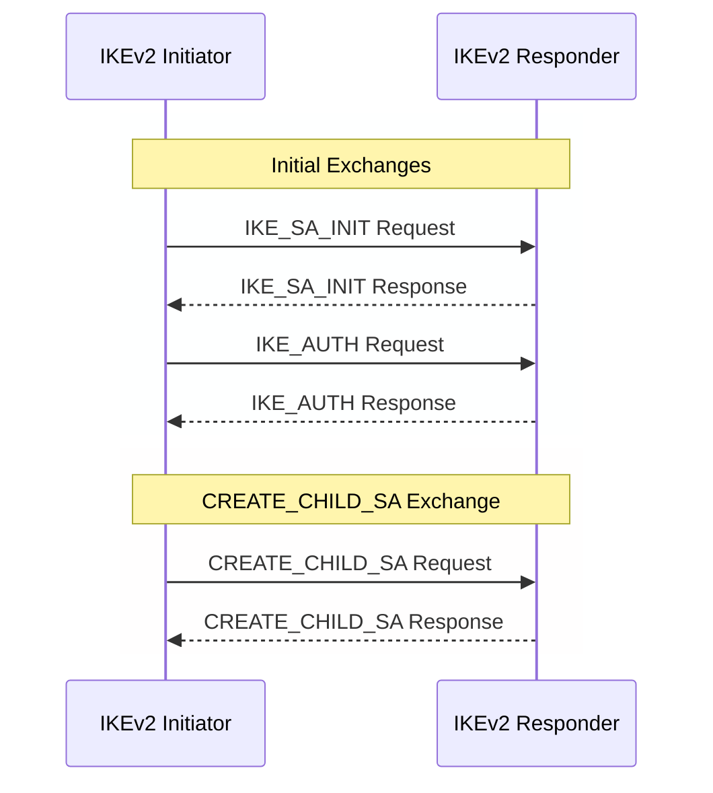

# IKE

IKE uses UDP port 500.

All of IKE is Request Response Pairs.

## Terms

**IKE** -- Internet Key Exchange

**SA** --- Security Association

- Shared Secret

- Set of Agreed on and Shared Cryptographic algorithms to transport information

**Message ID**

- Requests and Responses share the same Message ID
- 32 bits

**Initiator**

- Proposes a cryptographic suite

**Responder**

- Accepts or denies the requests

**ISAKMP** -- Internet Security Association and Key Management Protocol

- One method to perform key exchange.

## Requirements

IKE cannot be fragmented beyond 1280.

Retransmissions use the same Message ID.

Responses use the same Message ID.

## Process flow

### IKE_SA_INIT

- Negotiate Cryptographic Algorithms
- Nonce exchange
- DH exchange

### IKE_AUTH

- Encrypted using `IKE_SA_INIT`
  - Authenticates Previous Messages
  - Exchange Identities and certificates
  - Establish first child SA

### CREATE_CHILD_SA

Used for dataplane traffic.

## References

[What Is IKE (Internet Key Exchange)? | IKE Meaning - Palo Alto Networks](https://www.paloaltonetworks.com/cyberpedia/what-is-ike)

[Understand IPsec IKEv1 Protocol - Cisco](https://www.cisco.com/c/en/us/support/docs/security-vpn/ipsec-negotiation-ike-protocols/217432-understand-ipsec-ikev1-protocol.html#toc-hId--967296535)

[RFC 7296: Internet Key Exchange Protocol Version 2 (IKEv2) | RFC Editor](https://www.rfc-editor.org/info/rfc7296/)
