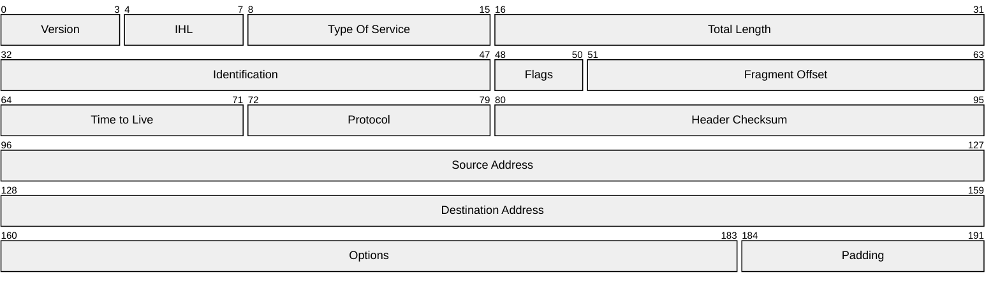

# IPv4 Header

| Field | Length | Description |
|-----------------------------------|----------|--------------------------------------------------------------------------------------------|
| **Version**                       | 4 bits   | `0100` for IPv4, `0110` for IPv6 |
| **IHL** — Internet Header Length  | 4 bits   | Length of the header in 32-bit words. Minimum value is 5 (no options, no padding). |
| **ToS** — Type of Service         | 8 bits   | Quality of Service. Now used for DSCP. |
| **Total Length**                  | 16 bits  | Total packet size in bytes (header + data). 16 bits × 8 = max packet size of 65,535 bytes. |
| **Identification**                | 16 bits  | Used to uniquely identify fragmented packets to add reassembly. |
| **Flags**                         | 3 bits   | always 0, May Fragment, More Fragments |
| **Fragment Offset**               | 13 bits  | Where in bytes this fragment belongs in the fragment chain. First fragment is set to 0. |
| **TTL** — Time to Live            | 8 bits   | Prevents routing loops. Each router decrements by 1; packet is discarded at 0. |
| **Protocol**                      | 8 bits   | What the packet encapsulates, Ex: 1 = ICMP, 6 = TCP, 17 = UDP, 88 = EIGRP, 89 = OSPF. |
| **Header Checksum**               | 16 bits  | Covers the IP header only (not data). Recomputed at each device that processes the IP header. |
| **Source Address**                | 32 bits  | The SA — IP address of the sending host. |
| **Destination Address**           | 32 bits  | The DA — IP address of the destination host. |
| **IP Options**                    | Variable | Loose/Strict Source Routing, Record Route, Timestamp. Mostly unused, historical. |
| **Padding**                       | Variable | Ensures the header ends on a 32-bit boundary. |

### Flags
<pre>
  Flags:  3 bits

    Various Control Flags.

      Bit 0: reserved, must be zero
      Bit 1: (DF) 0 = May Fragment,  1 = Don't Fragment.
      Bit 2: (MF) 0 = Last Fragment, 1 = More Fragments.

          0   1   2
        +---+---+---+
        |   | D | M |
        | 0 | F | F |
        +---+---+---+
</pre>
