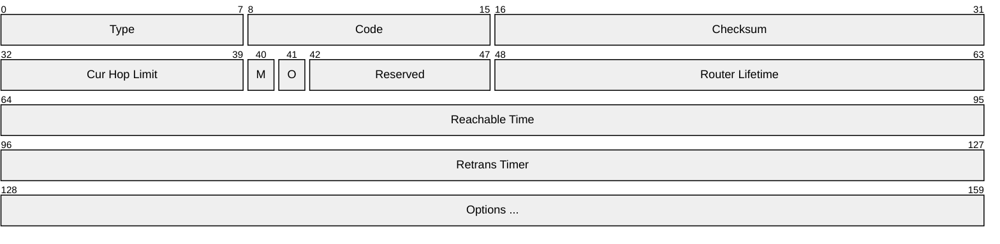
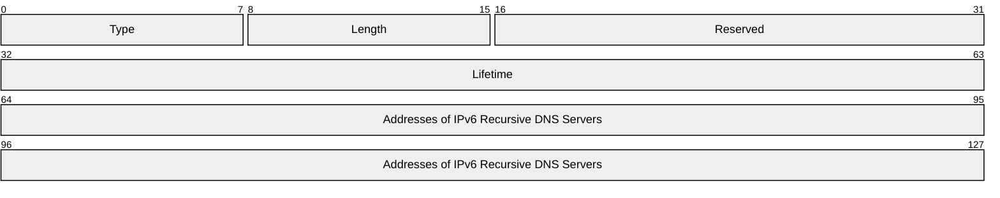

# IPv6 Neighbor Discovery

RA messages are sent with ICMPv6. These can carry options, so they've been extended to carry RDNSS information.

The router can say "Here is the DNS info".

## Terms

**RA** --- Router Advertisement

In v6, routers can just advertise the prefix of the attached subnet and options like RDNSS.

**RDNSS** --- Recursive DNS Server

## Router advertisements

From RFC [4861]: Neighbor Discovery for IP version 6 (IPv6).

[4861]: https://www.rfc-editor.org/info/rfc4861/#section-4.1



## RDNS server option

From RFC [8106]: IPv6 Router Advertisement Options for DNS Configuration

[8106]: https://www.rfc-editor.org/info/rfc8106/#section-5.1



## Packet capture

Taken from my home router 13-July-2026, I've modified the IPs.

```console
Frame 46: Packet, 174 bytes on wire (1392 bits), 174 bytes captured (1392 bits) on interface <removed>
Ethernet II, Src: Routerboardc_ef:69:14 (48:a9:8a:ef:69:14), Dst: IPv6mcast_01 (33:33:00:00:00:01)
Internet Protocol Version 6, Src: fe80::4aa9:8aff:feef:6914, Dst: ff02::1
Internet Control Message Protocol v6
    Type: Router Advertisement (134)
    Code: 0
    Checksum: 0xa34c [correct]
    [Checksum Status: Good]
    Cur hop limit: 0
    Flags: 0x00, Prf (Default Router Preference): Medium
    Router lifetime (s): 1800
    Reachable time (ms): 0
    Retrans timer (ms): 0
    ICMPv6 Option (Source link-layer address : 48:a9:8a:ef:69:14)
    ICMPv6 Option (Recursive DNS Server 2001:db8:12:15::6 2001:db8:12:15::7)
        Type: Recursive DNS Server (25)
        Length: 5 (40 bytes)
        Reserved
        Lifetime: 1800 (30 minutes)
        Recursive DNS Servers: 2001:db8:12:15::6
        Recursive DNS Servers: 2001:db8:12:15::7
    ICMPv6 Option (Recursive DNS Server fe80::4aa9:8aff:feef:6914)
        Type: Recursive DNS Server (25)
        Length: 3 (24 bytes)
        Reserved
        Lifetime: RDNSS address MUST no longer be used (0) (0 seconds)
        Recursive DNS Servers: fe80::4aa9:8aff:feef:6914
    ICMPv6 Option (Prefix information : 2001:db8:12:15::/64)
        Type: Prefix information (3)
        Length: 4 (32 bytes)
        Prefix Length: 64
        Flag: 0xc0, On-link Flag (L), Autonomous Address Configuration Flag (A)
            1... .... = On-link Flag (L): Set
            .1.. .... = Autonomous Address Configuration Flag (A): Set
            ..0. .... = Router Address Flag (R): Not set
            ...0 .... = DHCPv6-PD Preferred Flag (P): Not set
            .... 0000 = Reserved: 0
        Valid Lifetime: 2592000 (30 days)
        Preferred Lifetime: 604800 (7 days)
        Reserved
        Prefix: 2001:db8:12:15::
```

## Wireshark

BPF:`ip6 protochain 58`

## References

[RFC 4861: Neighbor Discovery for IP version 6 (IPv6) | RFC Editor](https://www.rfc-editor.org/info/rfc4861/)

[RFC 8106: IPv6 Router Advertisement Options for DNS Configuration | RFC Editor](https://www.rfc-editor.org/info/rfc8106/)
