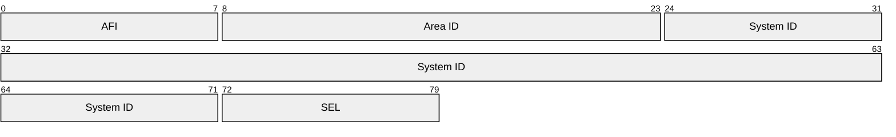

# IS-IS

## What is IS-IS

- Intermediate System To Intermediate System
- An ISO standard open protocol
- Link State and Shortest Path
- Good for large flat networks

### Terms

**IS**

- Intermediate System
- A router

**NSAP**

- Network Service Access Point

**NET**

- Network Entity Title
- A router
- Also refers to the address NSAP

**ES**

- End Station
- A PC, or a server

**Station Routing**

- AKA, intra-area
- Routing within a L1 area

**Area Routing**

- AKA, inter-area
- Routing within a L2 area
- The L2 area.

## Types of routers

### L2 routers

IS-IS doesn't refer to a backbone, but L2 routers perform the same function. They should be center-of-topology.

### L1L2 routers

These routes have topology information for the L1 area and the L2 area.

These are kind of like ABRs in OSPF.

### L1 router

These are the Area routers. They do not flood their link state databases into L2.

- Intra-area
- Default route out (sets the attached bit)
- Redistribution is allowed

## Example

```plain
                                             ┌──────┐
                                             │ L1   │
                                             └───┬──┘
                                                 │
┌──────┐     ┌──────┐        ┌──────┐        ┌───┴──┐     ┌─────┐
│  L1  ├─────┤ L1L2 ├────────┤  L2  ├────────┤ L1L2 ├─────┤ L1  │
└───┬──┘     └───┬──┘        └──────┘        └───┬──┘     └─────┘
    │            └──────┐                  ┌─────┘
┌───┴──┐             ┌──┴───┐          ┌───┴──┐
│  L1  │             │  L2  │──────────┤  L2  │
└──────┘             └──────┘          └──────┘
```


## Topologies

**Single Topology**

- All Routed Protocols must be configured on all enabled interfaces.
- e.g. v4 and v6 on all interfaces.

**Multi-Topology**

- Some interfaces can be v4, others can be v6, others can be both.

### Addressing scheme



**AFI**

- Authority and Format Identifier - 1 byte
- `49` means local authority, and hexadecimal (binary is encoded).

**Area ID**

- Variable, and ... *includes* the AFI

**System ID**

- 6 bytes, can fit a MAC address or a v4 address
- Must be unique in an area for L1
- Must be unique in a domain for L2

**SEL**

- Selector - 1 byte
- This is always `00` to mean router


**Example**

`net 49.0001.0000.0A00.0001.00`

So long as the NSAP is unique, its OK because we aren't routing CLNS.

Priority is used for the CLNS election.
Circuit ID, who won the election

## Etc

ISIS does not ride IP, it rides CLNS.
To do Multipoint NBMA you need to include CLNS resolution.

L1 areas must match

## Supported Network Types

- Point-to-point
- Broadcast

### IS-IS narrow

The Cisco default link cost is 10.

These are the limits:

- 63 per link
- 1 023 per path

### IS-IS wide

- 16 777 215 per link
- 4 294 967 295 per path

Cisco's implementation of the wide metric uses the bits ISO set aside for delay, expense and error.

### Config

Enable wide metrics:

```console
metric-style wide
```

#### Metric transition commands

Used when migrating from narrow to wide without a hard cutover:

| Command                           | Behavior                                                 |
|-----------------------------------|----------------------------------------------------------|
| `metric-style transition`         | Advertises **both** narrow and wide TLVs simultaneously  |
| `metric-style narrow transition`  | Transitioning — still **advertising narrow** (old)       |
| `metric-style wide transition`    | Transitioning — now **advertising wide** (new)           |

### IS-IS authentication

- Plaintext
  - Link, Area, or Domain
    - Link is between routers
    - Area is every router must have a matching password
    - L2 and L1/L2 router use domain authentication.


### Notes

Default route injected via route-map.

## References

[RFC 1195: Use of OSI IS-IS for routing in TCP/IP and dual environments | RFC Editor](https://www.rfc-editor.org/info/rfc1195/)

[RFC 5308: Routing IPv6 with IS-IS | RFC Editor](https://www.rfc-editor.org/info/rfc5308/)

[ISO/IEC 10589:2002 - Information technology — Telecommunications and information exchange between systems](https://www.iso.org/standard/30932.html)

[ISO/IEC 8348:2002 - Information technology — Open Systems Interconnection — Network service definition](https://www.iso.org/standard/35872.html)
