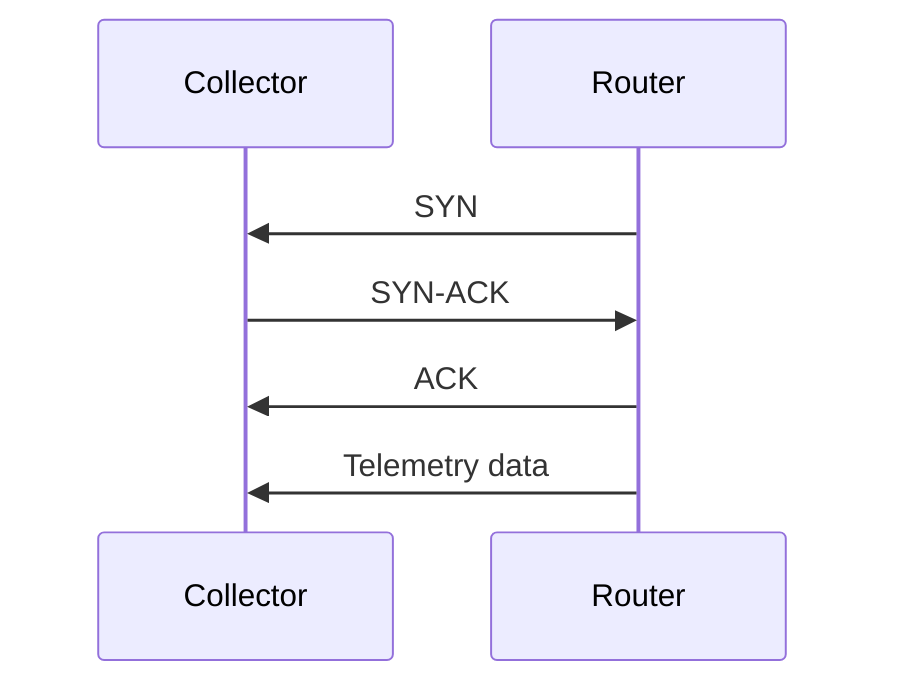
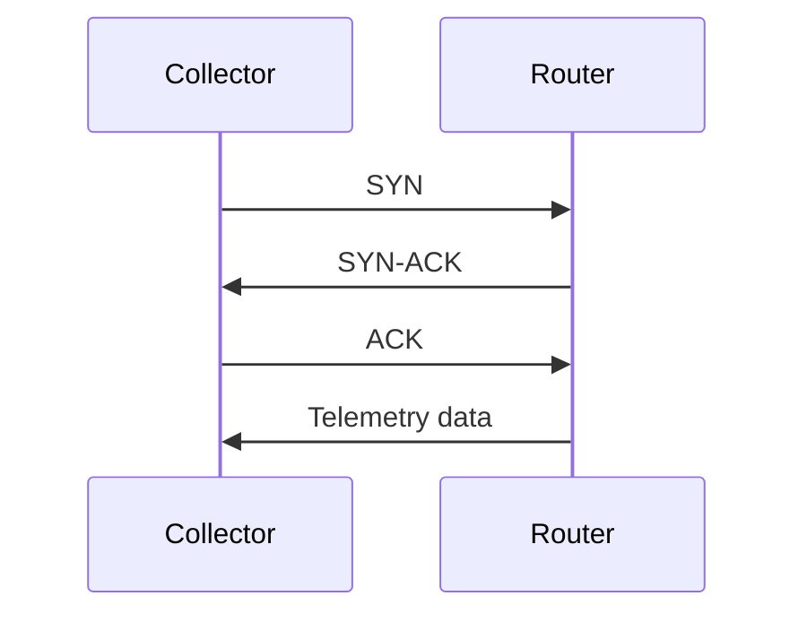

# MDT

* Can be ordinary TCP.
* Can also use gRPC, to add TLS.

## TCP Dial-out

## TCP Dial-in

## References

[Model-Driven Telemetry: Dial-In or Dial-Out ? | Telemetry | XRdocs](<https://xrdocs.io/telemetry/blogs/2017-01-20-model-driven-telemetry-dial-in-or-dial-out>)