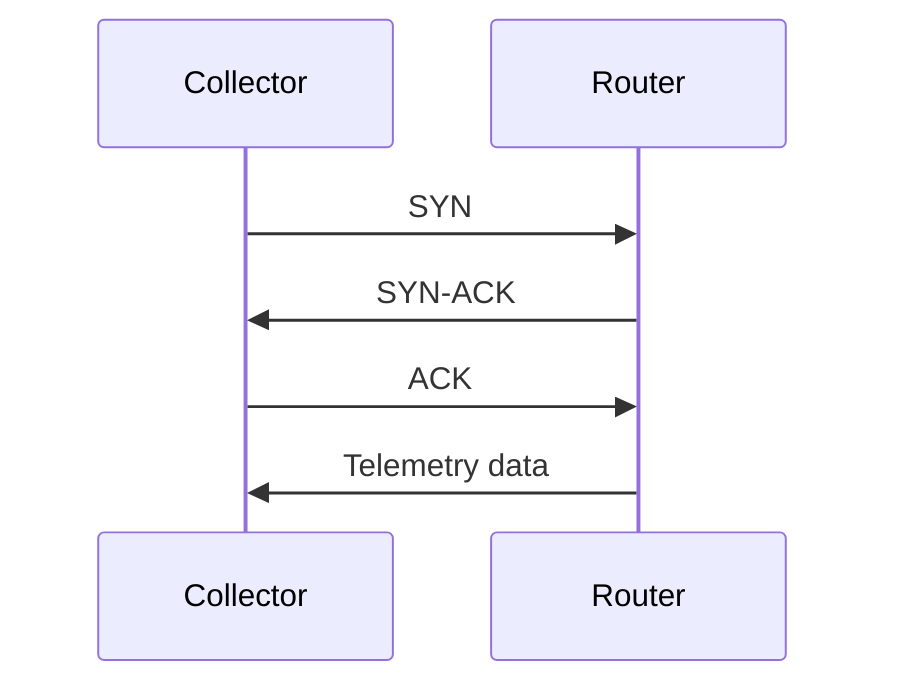
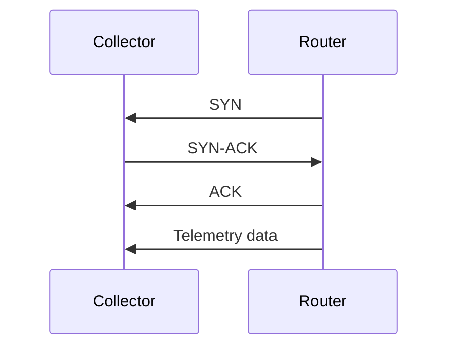

# MDT

**MDT**

- Model Driven Telemetry
- Can be ordinary TCP
- Can also use gRPC, to add TLS

## TCP dial-in

- Collector establishes a connection
- Then subscribes 

## TCP dial-out

- Telemetry is pushed to the collector

## References

[Cisco Live - gRPC, gNMI, gNOI ... Oh My! - Jeremy Cohoe - BRKDEV-2017](./pdfs/ciscolive/BRKDEV-2017.pdf)

[Model-Driven Telemetry: Dial-In or Dial-Out ? | Telemetry | XRdocs](<https://xrdocs.io/telemetry/blogs/2017-01-20-model-driven-telemetry-dial-in-or-dial-out>)
