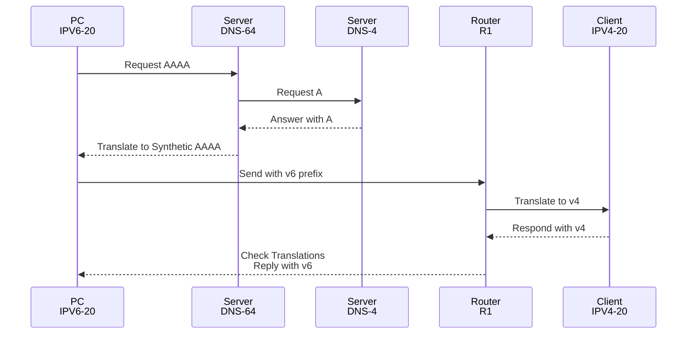

# NAT64

* Requires a DNS64 Server to translate an A record to a synthetic AAAA record.
* Requires a Upstream DNS to respond with an A record, to the DNS64 server.
* Requires a "Stateful Prefix"



## Config

```
ipv6 unicast-routing
!
! Define NAT64 Prefix
!
nat64 prefix stateful 2001:DB8:0:64::/96
!
! Create NAT64 pool
!
nat64 v4 pool DHCP_POOL64 10.0.0.100 10.0.0.200
!
! Create ACL for NAT64 Clients
!
ipv6 access-list ACL_NAT64_CLIENTS
  permit ipv6 2001:db8:1::/48 any
!
! Match v6 clients to the v4 pool
!
nat64 v6v4 list ACL_NAT64_CLIENTS pool DHCP_POOL64 overload
!
! Enable on v6 network
!
interface GigabitEthernet3
 ipv6 address 2001:db8:1::1/64
 nat64 enable
!
! Enable on v4 network
!
interface GigabitEthernet1
 ip address 10.0.0.1 255.255.255.0
 nat64 enable
```

## DNS64

apk update
apk add unbound
apk add bind-tools
rc-update add unbound default

```
DNS64:~# cat /etc/unbound/unbound.conf 
server:
    interface: 0.0.0.0
    interface: ::0
    access-control: 0.0.0.0/0 allow
    access-control: ::/0 allow
    do-ip4: yes
    do-ip6: yes
    do-udp: yes
    do-tcp: yes
    module-config: "dns64 iterator"
    # Do not use the Well-Known-Prefix, it breaks with private v4 addresses.
    # See https://datatracker.ietf.org/doc/html/rfc6052#section-3.4
    dns64-prefix: 2001:db8:0:64::/96

forward-zone:
        name: "."
        # A different upstream server, that returns only an A record.
        forward-addr:  2001:db8:1::6
```

## DNS4

Installing Apps
```
apk update
apk add unbound
apk add bind-tools
rc-update add unbound default
```

```
DNS4:~$ cat /etc/unbound/unbound.conf
server:
    interface: 0.0.0.0
    interface: ::0
    access-control: 0.0.0.0/0 allow
    access-control: ::/0 allow
    do-ip4: yes
    do-ip6: yes
    do-udp: yes
    do-tcp: yes
    local-data: "64lab.example.com. A 10.0.0.20"
```

## Verification


```
R1#show nat64 translations 

Proto  Original IPv4         Translated IPv4
       Translated IPv6       Original IPv6 
----------------------------------------------------------------------------

icmp   10.0.0.20:2           [2001:db8:0:64::a00:14]:2                       
       10.0.0.100:2          [2001:db8:1:0:5054:ff:fe11:d8ec]:2              

Total number of translations: 1
```

> The WKP (Well Known Prefix) will not work toward RFC1918 addresses. You must configure a different /96.


## References

[IP Addressing Configuration Guide, Cisco IOS XE 17.x - Stateful Network Address Translation 64 Cisco IOS XE 17 - Cisco](https://www.cisco.com/c/en/us/td/docs/routers/ios/config/17-x/ip-addressing/b-ip-addressing/m_iadnat-stateful-nat64.html)

[RFC 4291: IP Version 6 Addressing Architecture | RFC Editor](<https://www.rfc-editor.org/info/rfc4291/>)

[RFC 2464: Transmission of IPv6 Packets over Ethernet Networks](https://www.rfc-editor.org/rfc/rfc2464)
