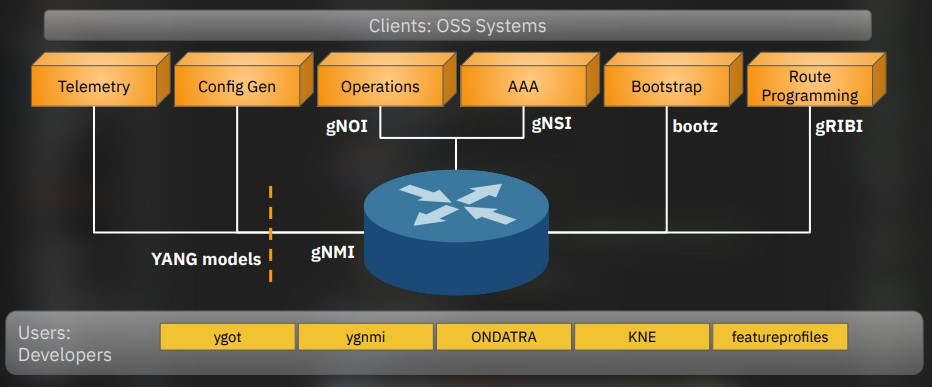

# OpenConfig Automation 

- Consortium of network operators
- Not a Standards Org
- Wants good [FOSS] YANG models
- Wants good [FOSS] to interact with YANG models

> OpenConfig is a collaborative effort by network operators to develop
programmatic interfaces and tools for managing networks in a more dynamic,
vendor-neutral way.

Source: [What is Openconfig?](https://www.openconfig.net/docs/faqs/faq/)

## Ecosystem

Google has done a lot of work in this area, their contributions are [FOSS], and they'd like to see it widely adopted.

Most of the existing network paradigms fail at scale.

SNMP at scale is [very broken].

[very broken]: ./snmp-is-dead.md

[FOSS]: https://en.wikipedia.org/wiki/Free_and_open-source_software 

Courtesy of NANOG 90, Rob Shakir's Keynote

## References

[google/gnxi: gNXI Tools - GitHub](https://github.com/google/gnxi)

[Rob Shakir's - Tag "openconfig"](https://rob.sh/tags/openconfig/)

[Rob Shakir's - Public Projects](https://rob.sh/tags/openconfig/)

[Network Visibility for the Automation Age - Rob Shakir](./pdfs/netvis-x.pdf)

[IETF 98 - Observations on Modeling Configuration and State in YANG](./pdfs/ietf/slides-98-rtgwg-openconfig-modeling-and-observations-00.pdf)

[RFC 5218: What Makes for a Successful Protocol? | RFC Editor](https://www.rfc-editor.org/info/rfc5218/)
