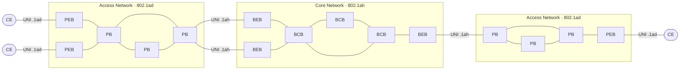

# PBB

PBB `802.1ah` PBB or MAC-in-MAC)

## Terms

* **PB:** Provider Bridge.
* **PEB:** Provider Edge Bridge.
* **B-Component:** A bridging component contained in a BEB that bridges in provider space (Backbone MAC addresses, B-VLAN).
* **BCB:** Backbone Core Bridge, An S-VLAN bridge used within the core of a PBBN.
* **BEB:** Backbone Edge Bridge, A backbone edge bridge positioned at the edge of PBBN that encapsulates customer frames for transmission across a PBBN.
* **B-MAC:** Backbone MAC Address. An individual MAC address associated with a Provider Instance Port (PIP) and used in creating the MAC header of I-tagged frames transmitted across a PBBN.

* **Backbone Service Instance:** An instance of the MAC service in a PBBN provided between two or more Virtual Instance Ports (VIPs) in BEBs.
* **I-SID:** Backbone Service Instance Identifier. A 24-bit field of the backbone service instance tag (I-TAG) that identifies
the backbone service instance of a frame. The I-SID defines the service instance that the frame should be "mapped to".
* **I-TAG** Backbone Service Instance Tag. A tag with a Ethertype value allocated for IEEE 802.1q backbone service instance tag type.
* **B-TAG:** Backbone VLAN Tag. A field defined in IEEE 802.1ah provider MAC encapsulation header that conveys the backbone VLAN ID information. The format of the B-TAG is same as that of an IEEE 802.1ad S-TAG field.
* **CBP:** Customer Backbone Port. A BEB port that can receive and transmit I-tagged frames for multiple customers,

and can assign B-VIDs (backbone VLAN IDs) and translate I-SID on the basis of the received I-SID.
* **I-Component:** A bridging component contained in a BEB that bridges in the Customer space (Customer MAC addresses, S-VLAN).
* **PIP:** Provider Instance Port. The set of Virtual Instance Ports (VIPs) that are supported by a single instance.
* **Service frame:** A frame exchanged between a provider and a customer.
* **VIP:** Virtual Instance Port. A bridge port on an I-Component in BEB that provides access to a single backbone service instance.

## References

[L2VPN and Ethernet Services Configuration Guide for Cisco ASR 9000 Series Routers, IOS XR Release 24.1.x, 24.2.x, 24.3.x, 24.4.x - Implementing IEEE 802.1ah Provider Backbone Bridge Cisco ASR 9000 Series Aggregation Services Routers - Cisco](https://www.cisco.com/c/en/us/td/docs/routers/asr9000/software/24xx/l2vpn/configuration/guide/b-l2vpn-cg-asr9000-24xx/m-implement-provider-backbone-bridge.html)