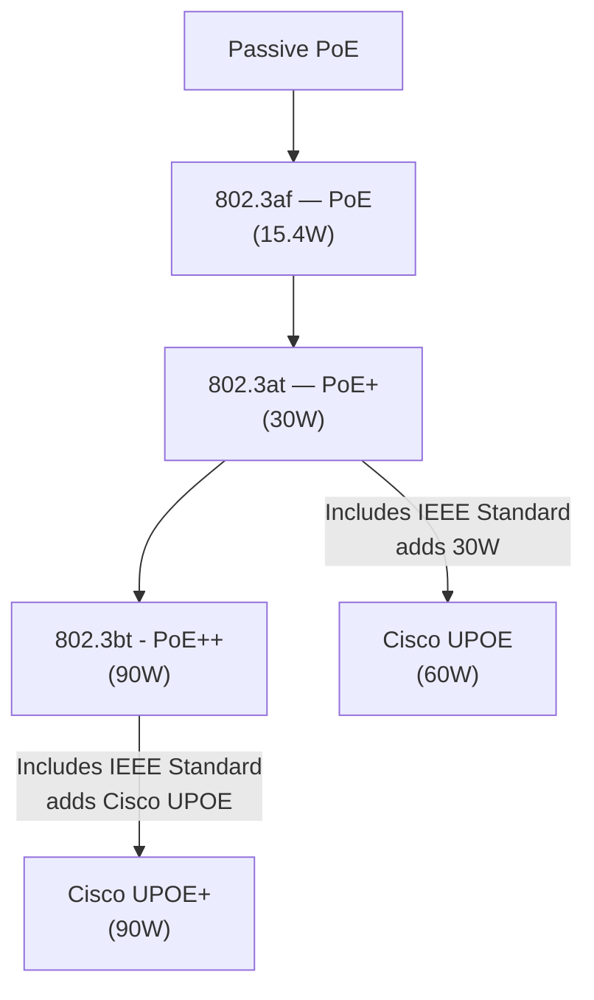

# Power Over Ethernet

- **PSE:** Power sourcing equipment, i.e. a PoE ethernet switch.
- **PD:** Powered Device, i.e. a phone.
- **PoE Splitter:** Use Ethernet as a power source for low power devices.
- **PoE Extender:** Increases Ethernet's Data and Power range beyond 100m.
- **Passive PoE:** AKA Pre-standard PoE. Usually old installs.
- **Endspan:** The switch is the PSE.
- **Midspan:** The PSE is an injector and daisy chained into the ethernet.
- **Mode-A:** AKA, Alt-A, Deliver power on the data pairs of 10Base-T, or 100Base-T. (pairs 2,3)
- **Mode-B:** AKA, Alt-B, Deliver power on the spare pairs of 10Base-T, or 100-Base-T. (pairs  1,4)
- **LLDP:** Link Layer Discovery Protocol. The IEEE equivalent to CDP. Used in PoE to request power.

> **Passive PoE**
>
> You must know and supply the correct voltage, there is no voltage or power negotiation.

**As a Table**

| Type               | IEEE Standard       | Maximum Power from PSE        | Supported Modes                        | Notes                   |
|--------------------|---------------------|-------------------------------|----------------------------------------|-------------------------|
| Passive PoE        | -                   |                               |                                        | No Negotiation          |
| PoE                | 802.3af             | 15.4W                         | Mode A or Mode B (2-pair)              |                         |
| PoE+               | 802.3at             | 30W                           | Mode A or Mode B (2-pair)              |                         |
| Cisco UPOE         | Superset of 802.3at | 60W                           | Mode A, Mode B, or 4-pair              | Works over CDP          |
| PoE++, AKA 4PPPoE  | 802.3bt aka 4PPoE   | 90W                           | Mode A, Mode B, or 4-pair              |                         |
| Cisco UPOE+        | Superset of 802.3bt | 90W                           | Mode A, Mode B, or 4-pair              | Works over CDP          |

**As a Flowchart**

**Cisco's Chart**

**Wire example - 4 Pairs**

**Power States**

## References

[Power over Ethernet - Wikipedia](https://en.wikipedia.org/wiki/Power_over_Ethernet)

[Cisco - Industrial Power over Ethernet (PoE)](https://www.ciscolive.com/c/dam/r/ciscolive/emea/docs/2024/pdf/BRKIOT-1128.pdf?cachemode=refresh)

[Cisco UPOE+: The Catalyst for Expanded IT-OT Convergence White Paper - Cisco](https://www.cisco.com/c/en/us/solutions/collateral/enterprise-networks/nb-06-upoe-plus-it-ot-wp-cte-en.html)
