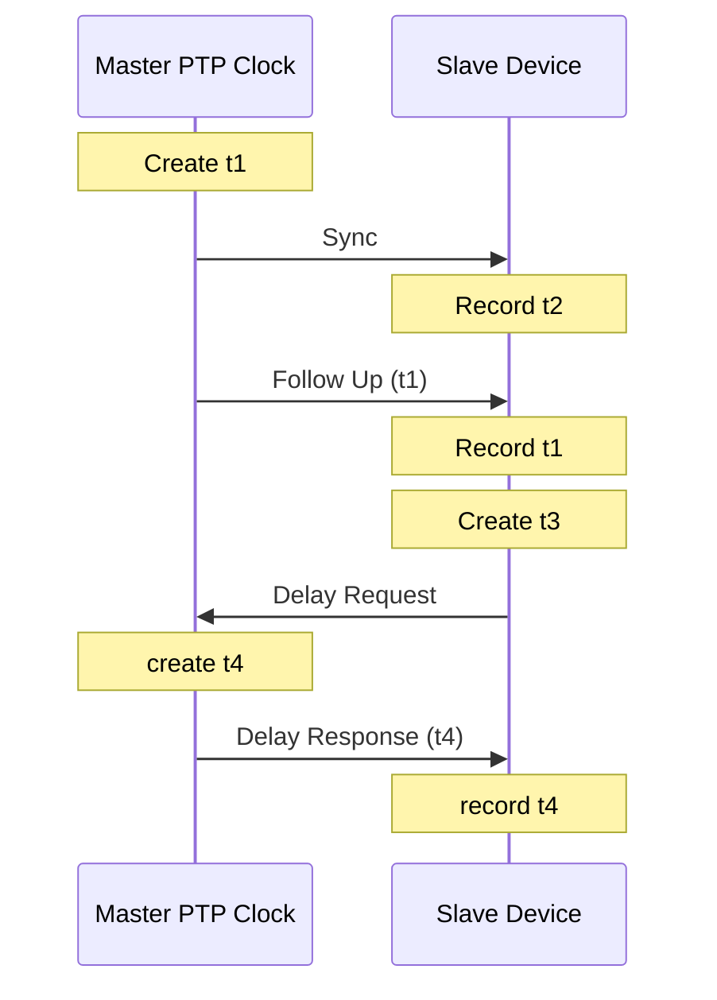

# PTP

**1 second**, is 1000 ms.

**1 millisecond:** Network latency is measured in ms, or 1 thousandth of a second 0.001.

**1 microsecond**


- 1 μs (a millionth) of a second
- 0.000 001
- 1000 μs is 1 ms

**1 nanosecond**


- 1 ns (a billionth) of a second
- 0.000 000 001
- 1000 ns is 1 μs

**NTP**

- An older time standard
- Can sync time between 10 to 1 ms

**PTP**

- Modern time standard
- Can sync time between 10 to 1 ns
- At minimum, ~1 million times more precise than NTP

**PTPv1**

- Defined in IEEE 1588-2002

**PTPv2**

- Defined in IEEE 1588-2008
- Not backwards compatible with v1

**PTPv2.1**

- Defined in IEEE 1588-2019
- Backward compatible with v2

**1588 Clock**

- Clock in the PTP time domain
- Clocks have ports

**Terminating Clock**

- Clock with one port

**Ordinary Clock**

- Clock in a terminating device
- Receives time

**Boundary Clock**

- Clock in a transmitting device, like an Ethernet switch
- Connects PTP domains

**Transparent Clock**

- Forwards PTP messages but updates the correction fields for residence time.

**Grandmaster**

- All clocks sync to this one clock

**Master**

- All clocks in a subdomain sync to the master
- The master sync's to the grand master.

## Time Terms

**Epoch**

- The start of time

**Offset**

- The estimated time between a master clock sending time, and a slave clock receiving it


## Uses

- Robotics, synchronizing movements
- Mobile Phone networks, telemetry, billing, logging
- Financial Networks, trade settling fairness
- Power Networks, to sync to the 60hz grid
- Science network, seismic data

## Process

After PTP has time from something like a GPS device, it can pass that time along, so long as the devices in the path can mark and read timestamps.



### Sync

- Server sends Sync
  - Creates t1


- Client gets Sync
  - Creates t2

    - Records t2

### Follow Up

(Nicer equipment doesn't need to send a Follow Up, if the first Sync contains an accurate timestamp)

- Server sends Follow-Up
  - Contains t1


- Client receives Follow-Up
  - Records t1


### Delay Request

- Client sends Delay-Request
  - Creates t3
    - Records t3

- Server receives Delay-Req
  - Creates t4

### Delay Response

- Server sends Delay-Response
  - Contains t4
  
- Client receives Delay-Response
  - Records t4

### Delay

Delay can only add time.

Delay is also easier, since the delay tends to be absolute.

We just need two kinds of values:

- Timestamp for message sent
- Timestamp for message received

We don't know the offset yet, but the offset shouldn't change much between messages.

\\[\text{delay} = \frac{(t_2 - t_1) + (t_4 - t_3)}{2} \\]

### Offset

Offset is subtracting the client time from the server time, and also subtracting the delay.

\\[\text{offset} = (t_2 - t_1) - \text{delay} \\]


## Config

### Commands

```console,editable
show ptp clock
show ptp brief
show ptp parent
show ptp port
!
! Platform
!
show platform software fed switch active ptp if-id {interface-id}
```

### Generalized PTP

[IEEE 802.1AS]

[IEEE 802.1AS]: https://www.cisco.com/c/en/us/td/docs/switches/lan/catalyst9500/software/release/17-17/configuration_guide/lyr2/b_1717_lyr2_9500_cg/configuring_generalized_precision_time_protocol.html#g-configuration-examples-for-gptp

```console,editable
!
! Using loopback0
!
ptp property P_GENERALIZED_PTP
  transport unicast ipv4 local Loopback0
    peer ip 198.51.100.1
    exit
  exit
ptp dot1as extend property P_GENERALIZED_PTP
```

### PTP

AKA [IEEE 1588](https://www.cisco.com/c/en/us/td/docs/switches/lan/catalyst9500/software/release/17-17/configuration_guide/lyr2/b_1717_lyr2_9500_cg/configuring_precision_time_protocol__ptp_.html)

Read the caveats.

```console,editable
ptp transport-protocol ipv4 udp
!
! four modes to choose from : two boundaries clocks
!                           : two transparent clocks
!
! this is the default mode, the switch doesn't participate in PTP.
!
ptp mode p2ptransparent
!
! Applying to ports
!
interface range gigabitethernet1/0/1-gigabitethernet1/0/2
  ptp sync interval -3
  ptp delay-req interval -3
exit
!
! Setting QoS
! 
ptp ip dscp 46 message general
ptp ip dscp 46 message event
end
```

## Resources

[Cisco - Understanding PTP](https://www.cisco.com/c/en/us/td/docs/iosxr/ncs560/timing-and-sync/25xx/b-network-sync-25xx-ncs560/precision-time-protocol.pdf)

[Cisco - Precision Time Protocol for Timing in IP Fabric for Media Guide](https://www.cisco.com/c/en/us/products/collateral/switches/nexus-9000-series-switches/guide-c07-742142.html)

[Cisco - Technote - Troubleshoot Precision Time Protocol on the Catalyst 9000](https://www.cisco.com/c/en/us/support/docs/switches/catalyst-9300-series-switches/221062-troubleshoot-precision-time-protocol-pt.html)

[Cisco - Configuring Precision Time Protocol (PTP) Cisco Catalyst 9500 Series Switches - IOS XE 17.17.x](https://www.cisco.com/c/en/us/td/docs/switches/lan/catalyst9500/software/release/17-17/configuration_guide/lyr2/b_1717_lyr2_9500_cg/configuring_precision_time_protocol__ptp_.html)

[Cisco - Whitepaper - PTP and SyncE basics with Cisco IOS XR Configuration](https://www.cisco.com/c/en/us/support/docs/ios-nx-os-software/ios-xr-software/217579-configure-ptp-and-synce-basics-with-cisc.html)

[Riedel - Transparent versus Boundary Clocks (PTP) in Broadcast Environments](https://www.riedel.net/fileadmin/user_upload/800-downloads/07-Guides/Transparent_versus_Boundary_Clocks.pdf)
