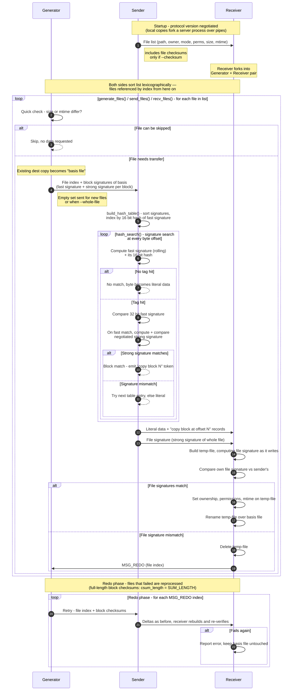

# Rsync

Based on Andrew Tridgell's 1999 PhD Thesis, [Efficient Algorithms for Sorting and Synchronization].

[Efficient Algorithms for Sorting and Synchronization]: /pdfs/andrew_tridgell_phd_thesis.pdf

rsync was designed to transfer differences between files over dialup links. 

rsync is phenomenal at data integrity since it's constantly comparing file hashes.

## Goals

- Update an existing file
- Only send the differences
- Avoid using network bandwidth
- Avoid back-and-forth, provide enough information upfront to perform the transfer
- Use compute
- Use lookup tables
- Use file hashes

We're into probability theory since we can't compare the data one-to-one, but we can do math to figure out the odds of a collision.

## The thought process

Two sides: \\(A\\) and \\(B\\).

File on both sides with changes: \\(A_i\\) and \\(B_i\\)

\\(B_i\\) is cut into equal sized blocks, those blocks are then signed.

\\(B\\) transmits the signature list to \\(A\\). Call that: \\(S\\)

\\(A\\) turns \\(S\\) into a sorted lookup table.

\\(A\\) starts to compare blocks inside of \\(A_i\\) against the weak signatures in \\(S\\). This lookup is performed at every byte offset and is called the **rolling checksum**.

\\(A\\) finds a weak match for a given block. To be sure it's an actual match, \\(A\\) then computes the strong signature.

\\(A\\) confirms the strong match. We can be confident this block is the same on both sides.

\\(A\\) tells \\(B\\) this block is the same.

### Why use a rolling checksum

We need a way to find block matches at any byte position that is not computationally expensive, since this check is performed at all byte offsets for a given file.

We cannot know in advance where a file has changed, but we can be certain parts of the file have not changed. If we pick a small enough block size we'll find lots of matched blocks at the expense of a larger lookup table.

Since we can't know where in the file the blocks will match, we'll need to slide this block along the file like a magnifying glass, removing one byte on the left, and adding one byte on the right.

If a file has 10,000 bytes, and we are looking for any 2000 bytes consecutive bytes that match, we potentially need to run this algorithm 8000 times.

We start at offset 0, the first 2000 bytes.

### Weak Signature

The weak signature is easy to calculate and only used to get a feel for if the data on both sides could potentially match. We use this so we aren't running complex and expensive computation for every single possible block of data ... because we are going to perform this math at every possible byte offset, like sliding a magnifying glass over a book. 

The weak signature has two purposes:

- easy and inexpensive to calculate
- limit the use of the more expensive strong signature

### Strong Signature

The strong signature is more computationally expensive to be "reasonably sure" the block on both sides is the same. We can pick different algorithms to be more or less sure.

### The File Signature

Since we are reading the files into memory to do these hashes, we might as well get a checksum for the entire file. That way we can be reasonably sure we've transferred the file not just a string of blocks.

## Starting Conditions

A sender and a receiver both have roughly the same data but not quite. Some file.

The Sender is \\(A\\).

The Receiver is \\(B\\).

We pick rsync to send data because a lot of the data in this file should be the same and unchanged, we don't want to send the whole file but the parts that haven't changed.

So we need a way to identify blocks of data that haven't changed, we'll pick two signature types for that data.

The **weak signature** for the rolling window we'll call \\(R\\).

The **strong signature** to be confident the data within a block hasn't changed we'll call \\(H\\).

We need two signatures because we are going to check the blocks of the sending file against the signatures of the receiving file in groups of \\(S\\) bytes.

We want to do this very fast, for every possible block of \\(S\\) bytes in the file.

We'll say the file is 10,000 bytes, and we are going to check in groups of 2000 bytes.

## The Algorithm

The 10,000 byte file, \\(B_i\\) is cut into 2000 byte blocks.

\\(S\\), these are the known signatures.

1. \\(B\\) cuts its 10,000 byte file into five blocks, and computes \\(R\\) and \\(H\\) for each block.

1. \\(B\\) sends over 5 groups of signatures, two signatures per block.

1. \\(A\\) starts with a byte offset of 0, block size of 2000, it computes \\(R_i\\) for this first block.

1. \\(A\\) compares \\(R_i\\) to the received signature table. There is no match, so \\(A\\) sends the literal first byte of the file.

1. \\(A\\) increments the byte offset by 1, effectively moving the entire calculated block over by 1 byte.

1. \\(A\\) computes \\(R_i\\) for this new block. There is no match, so \\(A\\) sends the literal second byte of the file.

1. \\(A\\) continues to do this, 1 byte at a time, this is the rolling window. It will send 1 byte each time there is no match.

1. At offset 150 \\(A\\) computes \\(R\\), and there is a match in the signature table.

1. \\(A\\) needs to know "Is this data really the same?" \\(A\\) now computes \\(H\\) for this block of data. 

1. \\(H\\) does not match, this is a **false positive**. \\(A\\) sends one literal byte of data.

1. Around offset 1230 \\(A\\) computes \\(R\\), and there is a match in the signature table.

1. \\(A\\) needs to know "Is this data really the same?" \\(A\\) now computes \\(H\\) for this block of data. 

1. Locally calculated \\(H\\) matches the signature table.

1. rsync has found a block of 2000 bytes which likely has not changed. \\(A\\) sends a token that says "use bytes at this signature for this block please."

1. \\(A\\) moves to offset 3230 and computes \\(R\\). Again there is a match in the signature table.

1. \\(A\\) needs to know "Is this data really the same?" \\(A\\) now computes \\(H\\) for this block of data. 

1. Locally calculated \\(H\\) matches the signature table.

1. rsync has found another block of 2000 bytes which likely have not changed. \\(A\\) sends a token that says "use bytes at this signature for this next block please."

1. \\(A\\) moves to offset 5230 and computes \\(R\\). Again there is a match in the signature table.

... this continues until it gets to the end of the file.

### What this looks like

\\(B\\) starting position

- \\(B\\) calculates \\(R\\) and \\(H\\) signatures for file \\(B_i\\)
- \\(B\\) sends signatures as file \\(S\\)

```text
┌───────────┬───────────┬───────────┬───────────┬───────────┐
│           │           │           │           │           │
└───────────┴───────────┴───────────┴───────────┴───────────┘
   (R1, H1)    (R2, H2)    (R3, H3)    (R4, H4)    (R5, H5)  
```

---

\\(A\\) Starting position, 0 byte offset.

- \\(A\\) receives \\(S\\)
- \\(A\\) begins to calculate \\(R_i\\) at offset 0

Comparing received \\(R\\) values to calculated \\(R_i\\). No match. Send literal byte.

```text
┌──────────┬───────────────────────────────────────────────┐
│          │                                               │
└──────────┴───────────────────────────────────────────────┘
    (R_i)                                                  
```

---

\\(A_i+1\\), a 1 byte offset.

Compare Received \\(R\\) values to calculated \\(R_i\\). No match. Send literal byte.
```text
┌┬──────────┬───────────────────────────────────────────────┐
││          │                                               │
└┴──────────┴───────────────────────────────────────────────┘
  (R_i=0+1)                                                
```

---

\\(A_i+150\\), a 150 byte offset.

Compare Received \\(R\\) values to calculated \\(R_i\\). \\(R_i\\) matches \\(R_2\\). 

Compute \\(H_i\\) and compare against \\(H_2\\). No match. False Positive. Send literal byte.

```text
┌──┬────────────┬───────────────────────────────────────────┐
│  │            │                                           │
└──┴────────────┴───────────────────────────────────────────┘
    (R_i=0+150)                                                  
```
---

Lots of no matches.

---

\\(A_i+1230\\), a 1230 byte offset.

Compare Received \\(R\\) values to calculated \\(R_i\\). \\(R_i\\) matches \\(R_1\\). 

Compute \\(H_i\\) and compare against \\(H_1\\). Match. Send match token.
```text
┌───────┬────────────┬──────────────────────────────────────┐
│       │            │                                      │
└───────┴────────────┴──────────────────────────────────────┘
         R_i = 0 + 1230                                                

```

---

\\(A_i+3230\\), a 3230 byte offset.

Compare Received \\(R\\) values to calculated \\(R_i\\). \\(R_i\\) matches \\(R_2\\). 

Compute \\(H_i\\) and compare against \\(H_2\\). Match. Send match token.

```text
┌──────────────┬────────────┬──────────────────────────────┐
│              │            │                              │
└──────────────┴────────────┴──────────────────────────────┘
               R_i = 0 + 3230                                
```

---

\\(A_i+5230\\), a 5230 byte offset.

Compare Received \\(R\\) values to calculated \\(R_i\\). \\(R_i\\) matches \\(R_3\\). 

Compute \\(H_i\\) and compare against \\(H_3\\). Match. Send match token.

```text
┌──────────────────────────┬───────────┬──────────────────┐
│                          │           │                  │
└──────────────────────────┴───────────┴──────────────────┘
                           R_i = 0 + 5230                  
```

---

\\(A_i+7230\\), a 7230 byte offset.

Compare Received \\(R\\) values to calculated \\(R_i\\). \\(R_i\\) matches \\(R_4\\). 

Compute \\(H_i\\) and compare against \\(H_4\\). Match. Send match token.

```text
┌─────────────────────────────────────┬────────┬────────┐
│                                     │        │        │
└─────────────────────────────────────┴────────┴────────┘
                                     R_i = 0 + 7230        
```

---

\\(A_i+9230\\), a 9230 byte offset.

Compare Received \\(R\\) values to calculated \\(R_i\\). \\(R_i\\) matches \\(R_5\\). 

Compute \\(H_i\\) and compare against \\(H_5\\). Match. Send match token.

```text
┌──────────────────────────────────────────────┬────────┐
│                                              │        │
└──────────────────────────────────────────────┴────────┘
                                              R_i = 0 + 9230
```

## Diagram

When rsync runs the `generate_files()` function looking for differences. This is called the **generator**.

After the differences are found they can be pipelined through rsync and follow this diagram.



## Moving files

I normally use rsync to move files since I like its checksum features.

> [!WARNING]
> **This example deletes source files**

```text,editable
rsync -aHAX -v --info=progress2 --remove-source-files \
  /mnt/intermezzo/ariadne/home-movies/ /mnt/intermezzo/home-video/
```

Removing empty directories afterwards

```console,editable
find . -type d -empty -delete
```


## Archive Mode

`-a` Archive mode. Archive mode  is `-rlptgoD (no -A,-X,-U,-N,-H)`

`-r` copy directories recursively

`-l` copy sym links, as symlinks

`-p` preserve permissions

`-t` preserve modification times

`-g` preserve group

`-o` preserve owner (super-user only)

`-D` preserve device files (super-user only) & preserve special files

## Other Options

`-H` preserve hard links

`-A` preserve ACLs

`-X` preserve extended attributes


## References

[Rsync at Samba](https://rsync.samba.org/)

[GitHub - RsyncProject/rsync: An open source utility that provides fast incremental file transfer. It also has useful features for backup and restore operations among many other use cases. · GitHub](https://github.com/rsyncproject/rsync)
