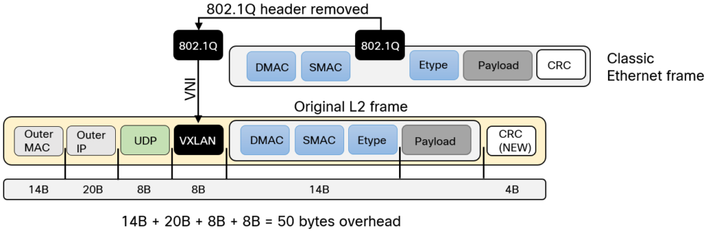

# SD-Access VXLAN

MAC-in-UDP Encapsulation.

Extends vlans to support 16 million network segments in the same administrative domain.

[Image courtesy of Lost In Transit]

[Image courtesy of Lost In Transit]: https://lostintransit.se/2023/08/17/introduction-to-vxlan/

VXLAN is VTEP to VTEP.
 - Outer-IP-SRC, VTEP that originated the packet
 - Outer-IP-DST IP, VTEP that needs the packet.
 - Outer-MAC-SRC, VTEP that created the packet.
 - Outer-MAC-DST, the device to reach the VTEP, the gateway.
 
Multi-destination Support is provided by multicast.

## VNI

- Virtual Network Identifier.
- 24 bits, 16 million segments.
- Get mapped to multicast groups.
- Used for macrosegmentation.

## VTEP

- Virtual Tunnel End point.
- Originates and Terminates tunnels.
  - push and pop VXLAN headers.
- Somitems a hypervisor (for app hosting)

## VXLAN Segment

- Only devices with the same VNI can communicate.
- AKA Overlay Network

## Layer 2 Overlay

The VNI is matched to a VLAN.

## Layer 3 Overlay

The VNI is matched to a VRF.

## References

[RFC 7348: Virtual eXtensible Local Area Network (VXLAN): A Framework for Overlaying Virtualized Layer 2 Networks over Layer 3 Networks | RFC Editor](https://www.rfc-editor.org/info/rfc7348/)

[Introduction to VXLAN – Daniels Networking Blog](https://lostintransit.se/2023/08/17/introduction-to-vxlan/)

[Cisco SD-Access Best Practices - Cisco Live 2025](https://www.ciscolive.com/c/dam/r/ciscolive/apjc/docs/2025/pdf/BRKENS-2502.pdf)
