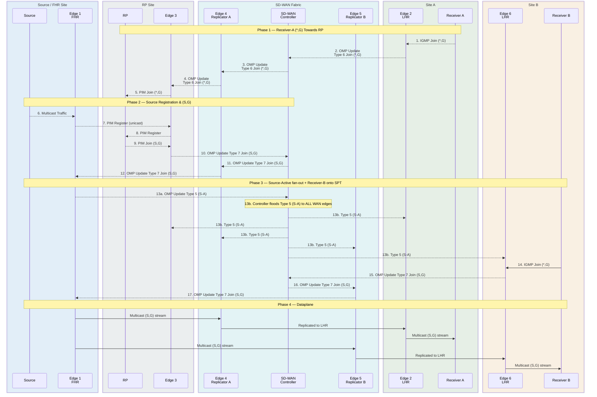

# SD-WAN Multicast

> [!NOTE]
> Data streams are forwarded to the receivers through replication.

## Terms

**Replicator**

The FHR forwards the multicast stream to the replicator.

## Multicast

- [PIM-SM] is supported
- the RP is one of the control nodes
- No Support for
  - BIDIR-PIM
  - MSDP
  
[PIM-SM]: https://www.cisco.com/c/en/us/td/docs/routers/sdwan/26x-later/routing/routing-configuration-guide/multicast-overlay/multicast-overlay-routing-for-sd-wan.html

## Flow

This is based on [BRKENT-3115], slides 107-110.

[BRKENT-3115]: ./pdfs/ciscolive/BRKENT-3115.pdf

## References

[Cisco Live - Empowering your Network with SDWAN OMP - Waqas Daar - BKRENT-3115](./pdfs/ciscolive/BRKENT-3115.pdf)

[Routing Configuration Guide for vEdge Routers, SD-WAN Release 20 - Multicast - Cisco](https://www.cisco.com/c/en/us/td/docs/routers/sdwan/configuration/routing/vEdge-20-x/routing-book/m-multicast-routing.html)

