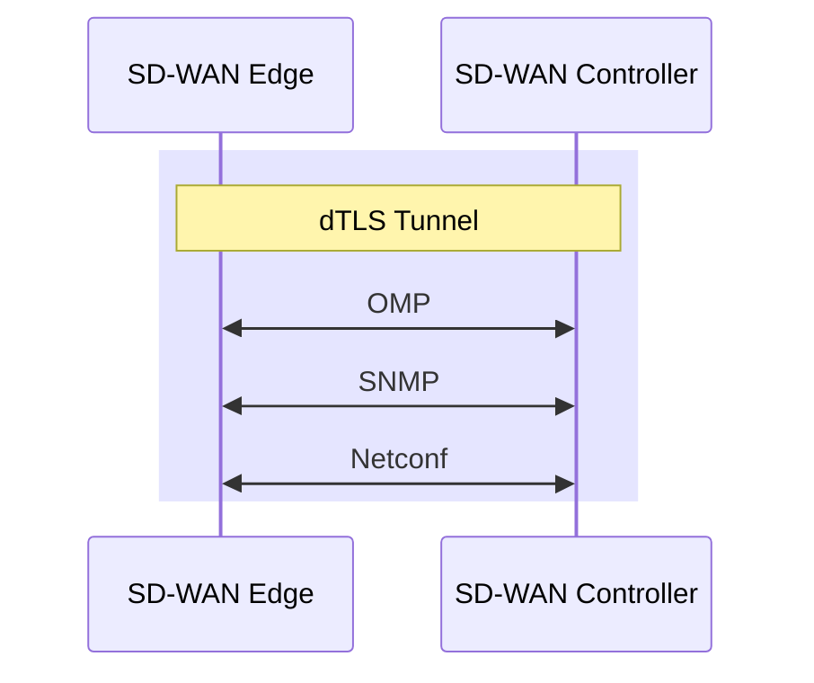

# SD-WAN Node Types

## Manager

- AKA vManage
- What a human interacts with, the GUI
- Speaks NETCONF to configure the other nodes
- AKA, the NMS

## Validator

- AKA, vBond
- Initial Authentication and provisioning,
- Responsible for NAT traversal
- AKA, Orchestration

Should be give a FQDN, so WAN edges have no problems finding it on connection to a DIA.

FQDNs also mean we aren't putting a static IP into a config.

Initial authentication is done with PKI, and RSA encryption.

Can not be placed behind NAT, unless the NAT device does a 1:1 static translation.

This device does the load balancing if multiple controllers are being used.

The Validator has a permanent dTLS tunnel to all the controllers.

## Controller

- AKA vSmart
- Holds the current state of the network, (routes and data policy) maintains active connections to the edges and programs them.
  - dTLS connections
    - OMP towards the WAN Edge
    - NETCONF towards the Manager
- Keeps all the routes between sites, that are managed via the OMP protocol (like BGP, but proprietary)
- Logical tunnel topologies (such as hub and spoke, regional, and partial mesh)
- Service Chaining
- Traffic Engineering
- Segmentation per VPN

## WAN Edge

- AKA vEdge, AKA Viptela (legacy gear)
- Dataplane, and Onsite
  - DIA, or MPLS.
- Has OMP, BGP, OSPF, EIGRP, ACLs, ARP, HA, and QoS
- Connects via dTLS to the controllers
- Connects via dTLS to other edges

## References

[Cisco Live - Empowering your Network with SDWAN OMP - Waqas Daar - BKRENT-3115](./pdfs/ciscolive/BRKENT-3115.pdf)
