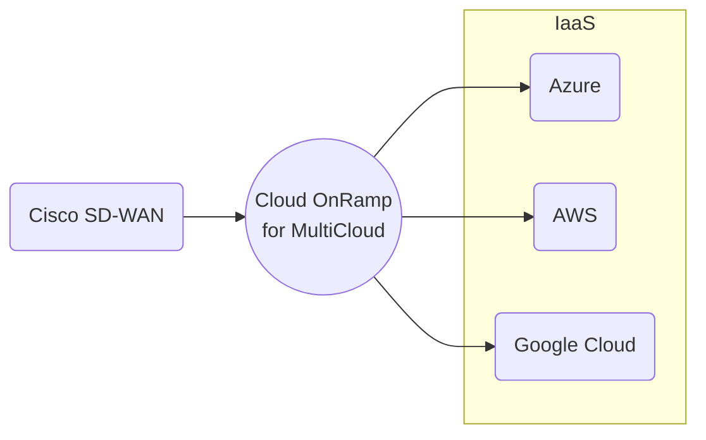
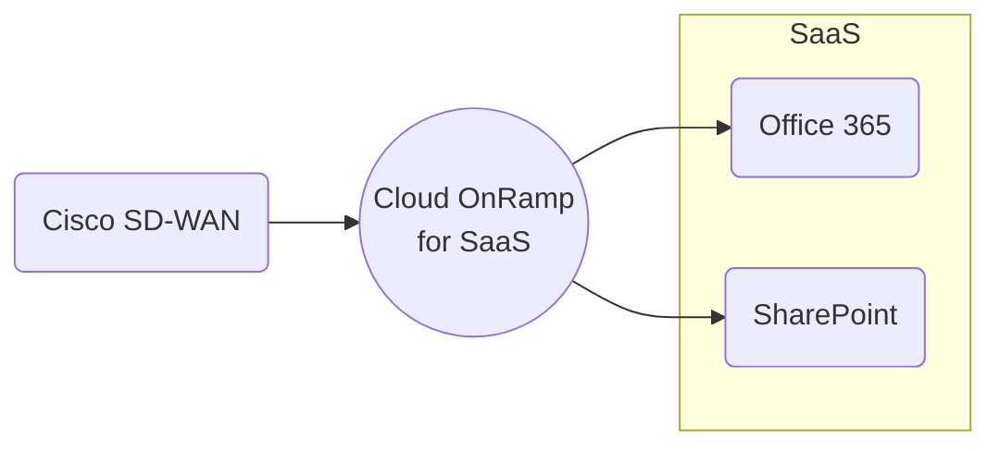

# SDWAN

## Terms

**DIA** --- Direct Internet Access

- Commodity Internet

**MPLS** --- Multi-protocol Label Switching

- A private network provided by an ISP.
- Expensive and fast.

**[BFD]** --- Bidirectional Forwarding Detection

[BFD]: bfd.md

## Cisco SD-WAN Cloud OnRamp

- Figures out the best path and measures jitter

[Portal Page]

[Portale Page]: https://www.cisco.com/site/us/en/solutions/networking/sdwan/cloud-onramp/index.html

### IAAS



### SaaS



## SD-WAN Policy

Policies are further classified as

- **Local Policy:** Programed on the edges. ACLs, QoS, routing, and AAA.
- **Centralized Policy:** Route policy, before being sent to the edges, (Topology, VPN Membership, Application Aware Routing)

## Application Aware Routing

**AAR** --- Application Aware Routing

**FEC** --- Forward Error Correction

- Every four packets, send a parity packet

**Packet Duplication** 

- Send twice as much data via two tunnels
- The receiving vEdge router can reconstruct it

**TCP Optimization and Session Persistence**

- High-latency links: satellite
- Open one TCP session
  - Proxy
  - Reuse
  - Never drop

**DRE** --- Data Redundancy Elimination

- Modern compression
- WAN links

**vQoE** --- Viptela Quality of Experience

- AAR, or CoR
- Edge sends HTTP probes to measure jitter and/or loss
- 0 to 10, 10 being best

## Colors

[TLOC color] indicates if the connection is behind NAT or not.

[TLOC color]: https://www.networkacademy.io/ccie-enterprise/sdwan/tloc-color-and-carrier

**Private colors**

- mpls, metro-ethernet
- private1, private2, private3, etc.

**Public Colors**

- public-internet, biz-internet
- 3g, lte
- blue, green, red, bronze, silver, gold


## VPNs

| VPN | Name/Role          | Description             |
|-----|--------------------|-------------------------|
| 0   | Transport/Underlay | ISP WAN Addresses       |
| 512 | Management         | Out-of-band Management  |
| n   | Service-Side/LAN   | 1-65527, not 0 or 512   |

## SDWAN Analytics

- Application Experience
  - Application Use

- Site Health
  - Tunnel Health

- Bandwidth Forecasting
  - Capacity Planning
  
- Talos Integration
  - Threat Mitigation

## Commands

```text,editable
!
! Control Setup
!
show sdwan control local-properties
show sdwan control connections
show sdwan control connection-history
!
! OMP
!
show sdwan omp peers
show sdwan omp routes
show sdwan omp tlocs
show sdwan omp services
show sdwan omp summary
show sdwan omp multicast-routes
!
! Validator
!
show orchestrator connections
```

## References

[Cisco Live - Empowering your Network with SDWAN OMP - Waqas Daar - BKRENT-3115](./pdfs/ciscolive/BRKENT-3115.pdf)

[Cisco Live - SD-WAN Start Here - Lars Granberg - BRKENT-2108](./pdfs/ciscolive/BRKENT-2108.pdf)

[Network Academy - SD-WAN Deep-Dive](https://www.networkacademy.io/ccie-enterprise/sdwan)

[Cisco Community - Cisco SD-WAN Webinar](https://community.cisco.com/t5/networking-knowledge-base/cisco-sd-wan-webinar-series/ta-p/5114270)

[Design Zone for Branch/WAN - Cisco Catalyst SD-WAN Design Guide - Cisco](<https://www.cisco.com/c/en/us/td/docs/solutions/CVD/SDWAN/cisco-sdwan-design-guide.html>)
