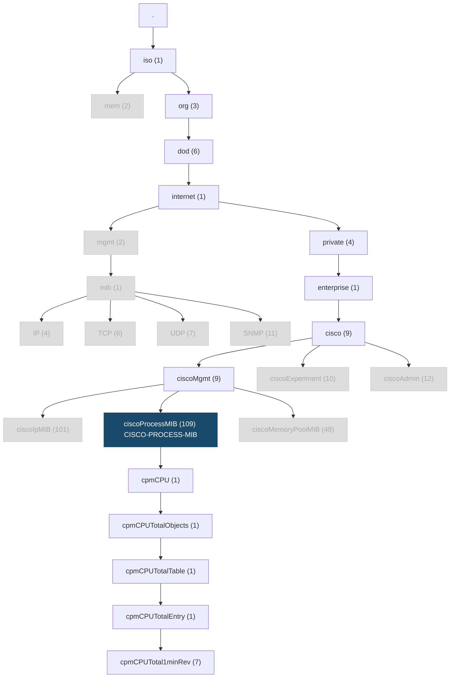

# SNMP

- **NMS:** Network Monitoring System

- **[SNMP](https://en.wikipedia.org/wiki/Simple_Network_Management_Protocol):** Simple Network Management Protocol. a protocol to exchange network device statistics.

- **Device Statistics:** ... uptime, packets sent, packets received, packets dropped, memory used, CPU used, temperature, fan-speed.

- **The Device:** A router, switch, or server.

- **The Agent:** Lives on the network device and collecting and storing metrics in a MIB, reading to send them with SNMP.

- **[MIB](https://en.wikipedia.org/wiki/Management_information_base):** Management Information Base. An on-device database. This is how the SNMP agent stores its information.

- **[ITU](https://en.wikipedia.org/wiki/International_Telecommunication_Union):** International Telecommunication Union. A UN agency responsible for international telecommunications.

- **OID Tree** An ITU, [X.660](https://www.itu.int/rec/T-REC-X.660-201107-I/en) standardized tree.


- **[OID](https://en.wikipedia.org/wiki/Object_identifier):** Object identifier. A node on an OID tree.

- **[IETF MIB](https://en.wikipedia.org/wiki/Management_information_base#IETF_maintained):** A standard MIB, defined by the IETF. These aren't very popular.

- **Vendor MIB:** In contrast to the IETF MIDs, vendors can create their own MIBs, attached to the OID tree.

## Finding used CPU time


On the device, I run a normal command, and look at the outputs:

```console
switch # show processes cpu | i util
CPU utilization for five seconds: 20%/0%; one minute: 21%; five minutes: 20%
```

So I want to figure out how to get the switch to report the first value "20" for "CPU used in the last 5 seconds."

- What MIB does a C3560CX support?
- I find the formal specification for the MIB somewhere on the vendor website: `CISCO-PROCESS-MIB (109)`
- Looking at the [OID tree first](https://github.com/cisco/cisco-mibs/blob/main/oid/CISCO-PROCESS-MIB.oid) I identify a possible leaf: `cpmCPUTotal1minRev via 1.3.6.1.4.1.9.9.109.1.1.1.1.7`
- Looking at the [MIB](https://github.com/cisco/cisco-mibs/blob/main/v2/CISCO-PROCESS-MIB.my) itself, I make sure it's a supported OID, by searching for `cpmCPUTotal1minRev`

I find this...

<pre>
cpmCPUTotal1minRev OBJECT-TYPE
    SYNTAX          Gauge32 (0..100)
    UNITS           "percent"
    MAX-ACCESS      read-only
    STATUS          current
    DESCRIPTION
        "The overall CPU busy percentage in the last 1 minute
        period. This object deprecates the object cpmCPUTotal1min

        and increases the value range to (0..100)."

    ::= { cpmCPUTotalEntry 7 }
</pre>

This is the OID leaf I'm going to query:

`.1.3.6.1.4.1.9.9.109.1.1.1.1.7`

written out it looks like this...

`iso.org.dod.internet.private.enterprise.cisco.ciscoMgmt.ciscoProcessMIB.cpmCPU.cpmCPUTotalObjects.cpmCPUTotalTable.cpmCPUTotalEntry.cpmCPUTotal1minRev`

 ... "how much CPU did this Cisco device use in the last 1 minute?"


[OIDREF](https://oidref.com/1.3.6.1.4.1.9.9.109.1.1.1.1.7) shows the SNMP world OID tree.



### Configs

**SNMP v2**
```console
snmp-server community SSG_PROMETHEUS ro
```

**SNMPv3**

```console
snmp-server group SSG_PROMETHEUS v3 priv
snmp-server user ciscosnmp SSG_PROMETHEUS v3 auth sha auth-password-goes-here priv aes 128 encryption-password-goes-here
```

### Verify

These are performed on a linux host. This is `apt install snmp` on Debian.

**SNMPv2**
```console
snmpwalk -v2c -c <community> <host> 1.3.6.1.4.1.9.9.109.1.1.1.1.7
```

**SNMPv3**
```console
snmpwalk -v3 -l authPriv -u <user> -a SHA -A  <auth-password> -x AES -X <encryption-password> <host> 1.3.6.1.4.1.9.9.109.1.1.1.1.7
```

```console
ariadne@tesseract:~$ snmpwalk -v3 -l authPriv -u ciscosnmp -a SHA -A <removed> -x AES -X <removed> <host> 1.3.6.1.4.1.9.9.109.1.1.1.1.7
iso.3.6.1.4.1.9.9.109.1.1.1.1.7.1 = Gauge32: 20
```


## Trap Severity

```console
snmp-server enable traps syslog
logging snmp-trap emergencies
logging snmp-trap alerts
logging snmp-trap critical
```


## Refereces

[Cisco - Consider SNMP](https://www.cisco.com/c/en/us/support/docs/ip/simple-network-management-protocol-snmp/9226-mibs-9226.html)

[How to find the MIB for Cisco Devices - Github](https://github.com/cisco/cisco-mibs#book-usage-guidelines)
