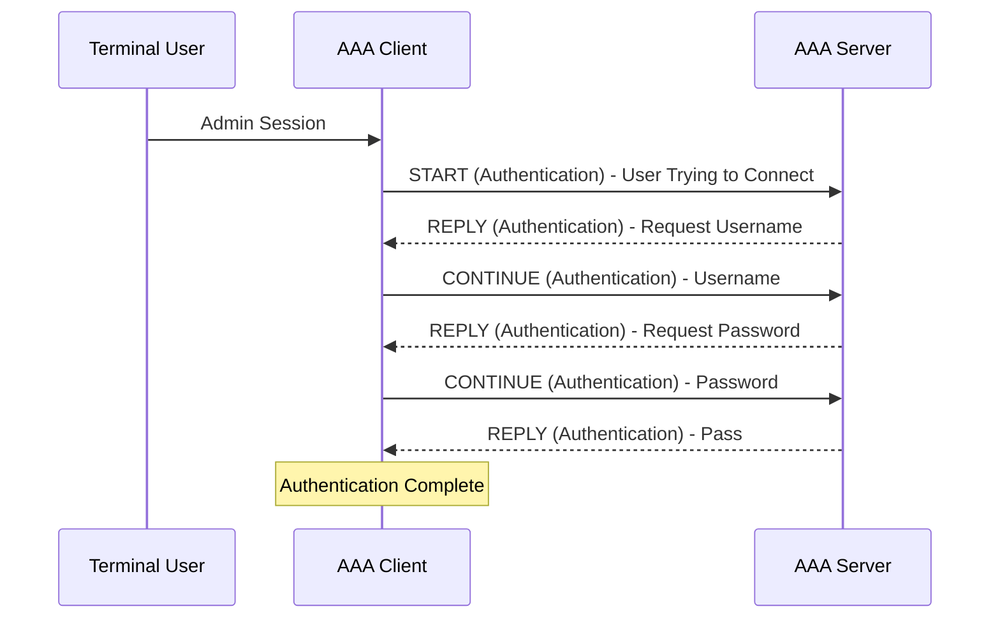
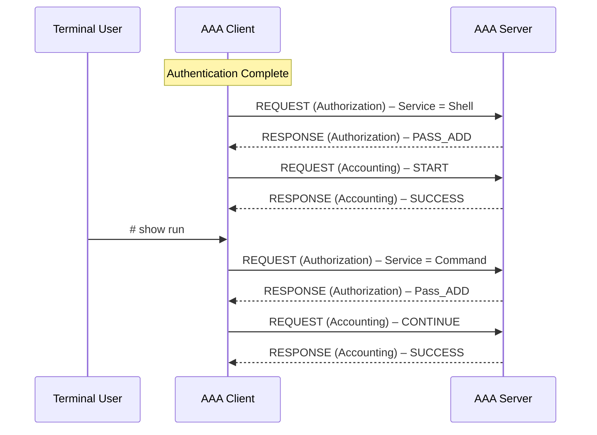

# TACACS+

## Terms

**RADIUS** --- Remote Authentication Dial-In User Service.

Created to provide AAA for ISP users, or Dial-In for businesses.

**TACACS** --- Terminal Access Controller Access-Control System.

An AAA protocol to provide support for authenticate once, authorize many.

**TACACS+**

Same as above, basically an upgraded version, not backward compatible.

**EAP** --- Extensible Authentication Protocol

802.1x, used for LAN Auth, only works with RADIUS.

## TACACS+ authentication messages

## TACACS authorization and accounting messages

# References

A. Woland, V. Santuka, J. Sanbower, and C. Mitchell, *Integrated Security Technologies and Solutions – Volume II: Cisco Security Solutions for Network Access Control, Segmentation, Context Sharing, Secure Connectivity, and Virtualization*. Hoboken, NJ, USA: Cisco Press, 2019, ISBN 978-1-58714-707-4.
