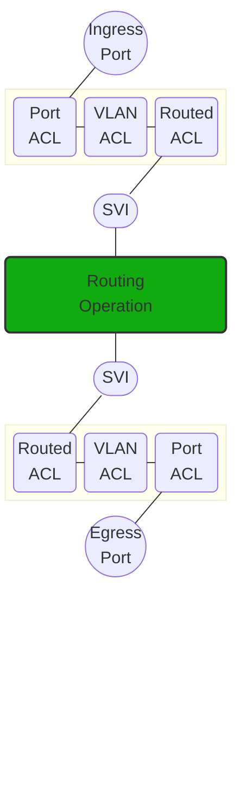
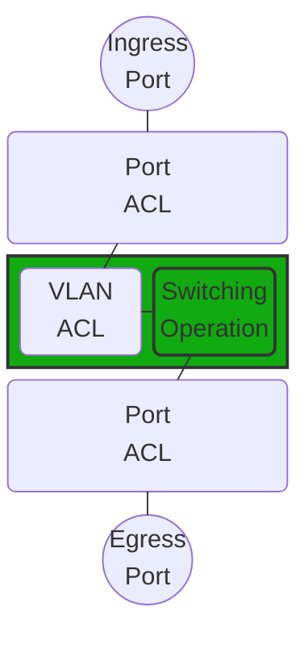

# VLAN Access Control Lists

Can be IPs and/or MACs.

These work on routed or switched traffic.

## Routed flow



## Switched flow

The VLAN ACL is only processed once, on switching operation.




## Config

Copied from the [TAC] notes.

[TAC]: https://www.cisco.com/c/en/us/support/docs/switches/catalyst-9500-series-switches/217266-validate-security-acls-on-catalyst-9000.html

```console
ip access-list extended TEST
 10 permit ip host 10.1.1.1 any
 20 permit ip any host 10.1.1.1
!
ip access-list extended ELSE
 10 permit ip any any
!
vlan access-map VACL 10
 match ip address TEST
 action forward
vlan access-map VACL 20
 match ip address ELSE
 action drop
!
vlan filter VACL vlan-list 10
```

## References

[Cisco Catalyst IR8340 Rugged Series Router Software Configuration Guide, Cisco IOS XE Release 17.15.x - VLAN Access Control Lists Cisco Catalyst IR8300 Rugged Series Router - Cisco](https://www.cisco.com/c/en/us/td/docs/routers/ir8340/software/configuration/b_ir8340_cg_17-15/m-vlan-access-control-lists.html)

[Validate Security ACLs on Catalyst 9000 Switches - Cisco](https://www.cisco.com/c/en/us/support/docs/switches/catalyst-9500-series-switches/217266-validate-security-acls-on-catalyst-9000.html)

[Solved: PACL and VACL processing order - Cisco Community](https://community.cisco.com/t5/switching/pacl-and-vacl-processing-order/td-p/5261049)
