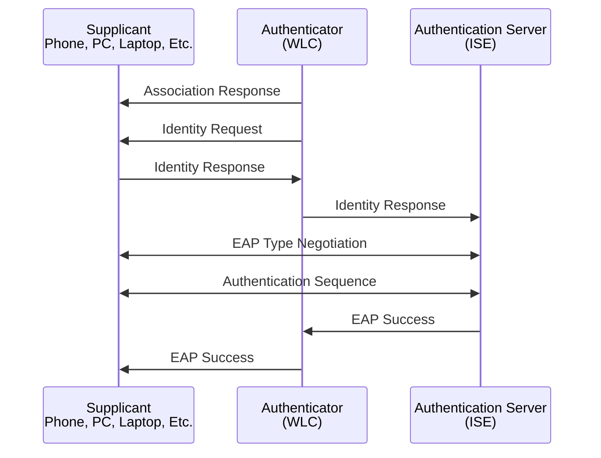
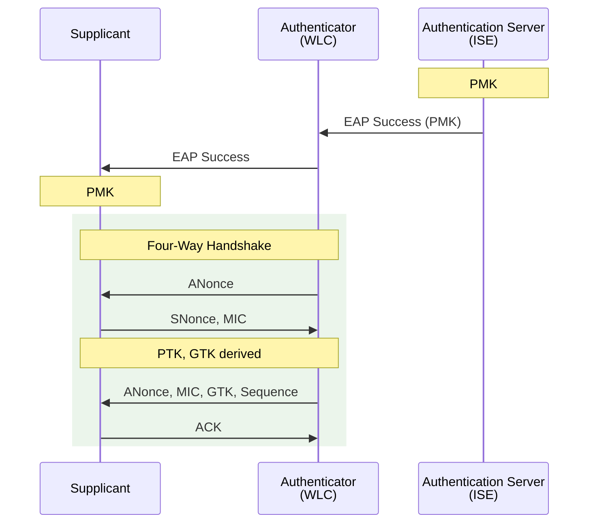

# Cisco Wireless Security

**WPA** -- Wireless Protected Access

WPA, includes TKIP

WPA2, includes AES

WPA3, removes older standards like TKIP

## Authentication, abstracted

Courtesy of [BRKEWN-3004].

[BRKEWN-3004]: /pdfs/ciscolive/BRKEWN-3004.pdf

## Encryption, abstracted

Courtesy of [BRKEWN-3004].

**PTK** --- Pairwise Transient Key

**GTK** --- Group Transient Key

**PMK** --- Pairwise Master Key

**STA** --- Station

**Anonce** -- Authenticator nonce, a random value generated by the authenticator

**Snonce** --- Supplicant nonce, a random value generated by the supplicant

\\(PTK = SHA(PMK + ANonce + SNonce + AP MAC + STA MAC)\\)

## References

[IEEE 802.11x Part 11: Wireless LAN Medium Access Control (MAC) and Physical Layer (PHY) Specifications](https://ieeexplore.ieee.org/document/10979691)

[Cisco Live - Understanding Wireless Security - Mark Krischer - BRKEWN-3004](/pdfs/ciscolive/BRKEWN-3004.pdf)
