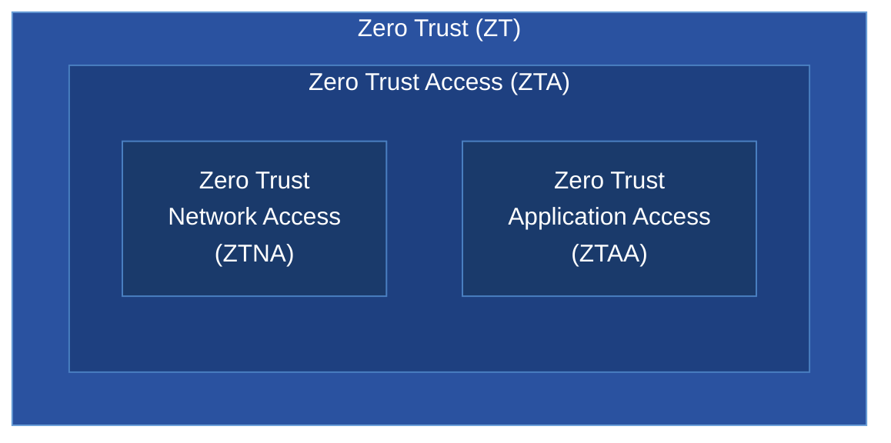

# Zero Trust

## Terms

**Zero Trust**

- Least privilege
- Access controls
- Continuous monitoring
- AKA ZT

**ZTA** -- Zero Trust Access

- Managing ZT on specific resources

**ZTNA** --- Zero Trust Network Access

- Networks

**ZTAA** -- Zero Trust Application Access

- Applications

**SPA** --- Secure Private Access

**SIA** --- Secure Internet Access

Access Lists without ACLs, using SGTs.

- Ingress
  - SGT is assigned when the packet is created
  
- Egress
  - SGT is read to grants or deny access
  
SGT Classification

SGT Propagation

## ZTA

### Client Based

Uses the Cisco Secure Client.

Works with either Auto-Enrollment or SAML.

- SPA & SIA

SPA works with a ZTA headend, and supports TCP or UDP.

### Clientless

SPA, no enrollment, uses SAML re-directs and browser challenges.

For private resources ZTA can proxy HTTP, SSH, and RDP sessions.

## References

[Cisco - Introduction to Resilient Zero Trust Access](https://securitydocs.cisco.com/docs/csa/best-practice/161173.dita)

[Cisco Live - Zero Trust Network Access Demystified - Steven Chimes - BRKSEC-2079](./pdfs/ciscolive/BRKSEC-2079.pdf)
